```mermaid
graph TB
    %% User Block - 核心用户模型
    subgraph User ["User Block"]
        User_id["_id: ObjectId"]
        User_name["name: String"]
        User_email["email: String"]
        User_password["password: String"]
        User_role["role: patient|doctor|admin"]
        User_phone["phone: String"]
        User_address["address: String"]
        User_dob["dateOfBirth: Date"]
        User_gender["gender: male|female|other"]
        
        %% 医生特有字段
        User_spec["specialization: String"]
        User_dept["department: String"]
        User_license["licenseNumber: String"]
        User_exp["experience: Number"]
        User_edu["education: String"]
        User_bio["bio: String"]
        
        %% 患者特有字段
        User_emergency["emergencyContact: Object"]
        User_history["medicalHistory: String[]"]
        User_allergies["allergies: String[]"]
        
        %% 通用字段
        User_avatar["avatar: String"]
        User_active["isActive: Boolean"]
        User_lastLogin["lastLogin: Date"]
        User_created["createdAt: Date"]
        User_updated["updatedAt: Date"]
        
        %% 方法
        User_match["matchPassword(enteredPassword): Boolean"]
        User_token["generateAuthToken(): String"]
    end
    
    %% Appointment Block - 预约模型
    subgraph Appointment ["Appointment Block"]
        Appt_id["_id: ObjectId"]
        Appt_patient["patient: ObjectId (ref: User)"]
        Appt_doctor["doctor: ObjectId (ref: User)"]
        Appt_date["date: Date"]
        Appt_time["timeSlot: String"]
        
        %% 状态管理
        Appt_status["status: pending|confirmed|cancelled|completed|no-show"]
        Appt_type["type: consultation|follow-up|emergency|routine"]
        
        %% 医疗信息
        Appt_symptoms["symptoms: String"]
        Appt_notes["notes: String"]
        
        %% 取消信息
        Appt_cancelReason["cancellationReason: String"]
        Appt_cancelledBy["cancelledBy: ObjectId (ref: User)"]
        Appt_cancelledAt["cancelledAt: Date"]
        
        %% 系统字段
        Appt_reminder["reminderSent: Boolean"]
        Appt_created["createdAt: Date"]
        Appt_updated["updatedAt: Date"]
        
        %% 方法
        Appt_updateStatus["updateStatus(newStatus): void"]
        Appt_cancel["cancel(reason, cancelledBy): void"]
    end
    
    %% MedicalRecord Block - 病历模型
    subgraph MedicalRecord ["MedicalRecord Block"]
        Record_id["_id: ObjectId"]
        Record_patient["patient: ObjectId (ref: User)"]
        Record_doctor["doctor: ObjectId (ref: User)"]
        Record_appointment["appointment: ObjectId (ref: Appointment)"]
        Record_visitDate["visitDate: Date"]
        
        %% 医疗信息
        Record_symptoms["symptoms: String"]
        Record_diagnosis["diagnosis: String"]
        Record_treatment["treatment: String"]
        
        %% 处方信息
        Record_prescription["prescription: Object"]
        
        %% 生命体征
        Record_vitals["vitalSigns: Object"]
        
        %% 检查结果
        Record_labResults["labResults: Object[]"]
        
        %% 附件
        Record_attachments["attachments: Object[]"]
        
        %% 随访信息
        Record_notes["notes: String"]
        Record_followUp["followUpDate: Date"]
        Record_followUpNotes["followUpNotes: String"]
        
        %% 系统字段
        Record_active["isActive: Boolean"]
        Record_created["createdAt: Date"]
        Record_updated["updatedAt: Date"]
        
        %% 方法
        Record_addAttachment["addAttachment(file): void"]
        Record_updateVitals["updateVitalSigns(signs): void"]
        Record_addLabResult["addLabResult(result): void"]
    end
    
    %% DoctorSchedule Block - 医生排班模型
    subgraph DoctorSchedule ["DoctorSchedule Block"]
        Schedule_id["_id: ObjectId"]
        Schedule_doctor["doctor: ObjectId (ref: User)"]
        Schedule_date["date: Date"]
        
        %% 时间段管理
        Schedule_timeSlots["timeSlots: Object[]"]
        
        %% 工作信息
        Schedule_working["isWorkingDay: Boolean"]
        Schedule_notes["notes: String"]
        Schedule_maxAppt["maxAppointments: Number"]
        
        %% 系统字段
        Schedule_created["createdAt: Date"]
        Schedule_updated["updatedAt: Date"]
        
        %% 方法
        Schedule_addSlot["addTimeSlot(time, isAvailable): void"]
        Schedule_updateSlot["updateTimeSlot(time, isAvailable): void"]
        Schedule_getSlots["getAvailableSlots(): String[]"]
    end
    
    %% Notice Block - 通知模型
    subgraph Notice ["Notice Block"]
        Notice_id["_id: ObjectId"]
        Notice_recipient["recipientId: ObjectId (ref: User)"]
        Notice_sender["senderId: ObjectId (ref: User)"]
        
        %% 通知内容
        Notice_type["type: appointment_request|appointment_confirmed|appointment_cancelled|medical_record_added|new_message|system_notice"]
        Notice_title["title: String"]
        Notice_content["content: String"]
        
        %% 关联信息
        Notice_relatedId["relatedId: ObjectId"]
        Notice_relatedType["relatedType: appointment|medical_record|message|system"]
        
        %% 状态管理
        Notice_read["isRead: Boolean"]
        Notice_active["isActive: Boolean"]
        
        %% 系统字段
        Notice_created["createdAt: Date"]
        Notice_updated["updatedAt: Date"]
        
        %% 静态方法
        Notice_createRequest["createAppointmentRequest(): Notice"]
        Notice_createConfirmed["createAppointmentConfirmed(): Notice"]
        Notice_createRecord["createMedicalRecordAdded(): Notice"]
        Notice_createMessage["createNewMessage(): Notice"]
        Notice_createSystem["createSystemNotice(): Notice"]
        
        %% 实例方法
        Notice_markRead["markAsRead(): void"]
    end
    
    %% 关系定义
    User -->|"1"| Appointment
    User -->|"1"| Appointment
    User -->|"1"| MedicalRecord
    User -->|"1"| MedicalRecord
    User -->|"1"| Notice
    User -->|"1"| Notice
    User -->|"1"| DoctorSchedule
    Appointment -->|"1"| MedicalRecord
    Appointment -->|"1"| Notice
    Appointment -->|"1"| DoctorSchedule
    MedicalRecord -->|"1"| Notice
    
    classDef userBlock fill:#e3f2fd,stroke:#1976d2,stroke-width:3px
    classDef appointmentBlock fill:#e8f5e8,stroke:#388e3c,stroke-width:2px
    classDef recordBlock fill:#fff3e0,stroke:#f57c00,stroke-width:2px
    classDef scheduleBlock fill:#f3e5f5,stroke:#7b1fa2,stroke-width:2px
    classDef noticeBlock fill:#ffebee,stroke:#d32f2f,stroke-width:2px
    
    class User userBlock
    class Appointment appointmentBlock
    class MedicalRecord recordBlock
    class DoctorSchedule scheduleBlock
    class Notice noticeBlock
```

```mermaid
graph TB
    %% 系统核心块
    subgraph HealthcareSystem ["HealthcareSystem Block"]
        System_name["systemName: String"]
        System_version["version: String"]
        System_env["environment: String"]
        System_active["isActive: Boolean"]
        System_start["start(): void"]
        System_stop["stop(): void"]
        System_restart["restart(): void"]
    end
    
    %% 认证模块
    subgraph AuthenticationModule ["AuthenticationModule Block"]
        Auth_jwtSecret["jwtSecret: String"]
        Auth_jwtExp["jwtExpiration: Number"]
        Auth_bcryptRounds["bcryptRounds: Number"]
        Auth_authenticate["authenticateUser(email, password): User"]
        Auth_generateToken["generateToken(user): String"]
        Auth_verifyToken["verifyToken(token): Object"]
        Auth_hashPassword["hashPassword(password): String"]
        Auth_validatePassword["validatePassword(password, hash): Boolean"]
    end
    
    %% 预约管理模块
    subgraph AppointmentModule ["AppointmentModule Block"]
        ApptMod_maxPerDay["maxAppointmentsPerDay: Number"]
        ApptMod_duration["appointmentDuration: Number"]
        ApptMod_create["createAppointment(data): Appointment"]
        ApptMod_update["updateAppointment(id, data): Appointment"]
        ApptMod_cancel["cancelAppointment(id, reason): Appointment"]
        ApptMod_getSlots["getAvailableSlots(doctorId, date): Array"]
        ApptMod_sendReminders["sendReminders(): void"]
    end
    
    %% 病历管理模块
    subgraph MedicalRecordModule ["MedicalRecordModule Block"]
        RecordMod_maxFileSize["maxFileSize: Number"]
        RecordMod_allowedTypes["allowedFileTypes: String[]"]
        RecordMod_create["createRecord(data): MedicalRecord"]
        RecordMod_update["updateRecord(id, data): MedicalRecord"]
        RecordMod_upload["uploadAttachment(recordId, file): Object"]
        RecordMod_generateReport["generateReport(patientId): Object"]
        RecordMod_export["exportRecords(filters): Buffer"]
    end
    
    %% 通知模块
    subgraph NotificationModule ["NotificationModule Block"]
        NoticeMod_supportedTypes["supportedTypes: String[]"]
        NoticeMod_emailEnabled["emailEnabled: Boolean"]
        NoticeMod_smsEnabled["smsEnabled: Boolean"]
        NoticeMod_pushEnabled["pushEnabled: Boolean"]
        NoticeMod_send["sendNotification(recipient, type, data): void"]
        NoticeMod_markRead["markAsRead(noticeId): void"]
        NoticeMod_getUnread["getUnreadCount(userId): Number"]
        NoticeMod_createSystem["createSystemNotice(recipients, content): void"]
    end
    
    %% 排班管理模块
    subgraph ScheduleModule ["ScheduleModule Block"]
        ScheduleMod_defaultMax["defaultMaxAppointments: Number"]
        ScheduleMod_timeSlots["timeSlots: String[]"]
        ScheduleMod_create["createSchedule(doctorId, date, slots): DoctorSchedule"]
        ScheduleMod_update["updateSchedule(scheduleId, slots): DoctorSchedule"]
        ScheduleMod_getSlots["getAvailableSlots(doctorId, date): Array"]
        ScheduleMod_checkAvailability["checkAvailability(doctorId, date, time): Boolean"]
    end
    
    %% 用户管理模块
    subgraph UserManagementModule ["UserManagementModule Block"]
        UserMod_roles["userRoles: String[]"]
        UserMod_minPassword["minPasswordLength: Number"]
        UserMod_emailVerification["emailVerificationRequired: Boolean"]
        UserMod_create["createUser(data): User"]
        UserMod_update["updateUser(id, data): User"]
        UserMod_delete["deleteUser(id): Boolean"]
        UserMod_changePassword["changePassword(userId, oldPassword, newPassword): Boolean"]
        UserMod_resetPassword["resetPassword(email): Boolean"]
    end
    
    %% 数据库连接模块
    subgraph DatabaseModule ["DatabaseModule Block"]
        DB_connectionString["connectionString: String"]
        DB_maxConnections["maxConnections: Number"]
        DB_connectionTimeout["connectionTimeout: Number"]
        DB_connect["connect(): void"]
        DB_disconnect["disconnect(): void"]
        DB_backup["backup(): void"]
        DB_restore["restore(backupFile): void"]
        DB_getStats["getConnectionStats(): Object"]
    end
    
    %% 文件存储模块
    subgraph FileStorageModule ["FileStorageModule Block"]
        File_storagePath["storagePath: String"]
        File_maxFileSize["maxFileSize: Number"]
        File_allowedTypes["allowedTypes: String[]"]
        File_upload["uploadFile(file, path): String"]
        File_delete["deleteFile(filePath): Boolean"]
        File_getUrl["getFileUrl(filePath): String"]
        File_createBackup["createBackup(): void"]
    end
    
    %% 系统关系
    HealthcareSystem -->|"uses"| AuthenticationModule
    HealthcareSystem -->|"uses"| AppointmentModule
    HealthcareSystem -->|"uses"| MedicalRecordModule
    HealthcareSystem -->|"uses"| NotificationModule
    HealthcareSystem -->|"uses"| ScheduleModule
    HealthcareSystem -->|"uses"| UserManagementModule
    HealthcareSystem -->|"uses"| DatabaseModule
    HealthcareSystem -->|"uses"| FileStorageModule
    
    %% 模块间关系
    AuthenticationModule -->|"authenticates"| UserManagementModule
    AppointmentModule -->|"checks availability"| ScheduleModule
    AppointmentModule -->|"sends notifications"| NotificationModule
    MedicalRecordModule -->|"stores attachments"| FileStorageModule
    MedicalRecordModule -->|"sends notifications"| NotificationModule
    ScheduleModule -->|"manages doctor schedules"| UserManagementModule
    
    classDef systemBlock fill:#e1f5fe,stroke:#01579b,stroke-width:3px
    classDef moduleBlock fill:#f3e5f5,stroke:#4a148c,stroke-width:2px
    classDef databaseBlock fill:#e8f5e8,stroke:#1b5e20,stroke-width:2px
    
    class HealthcareSystem systemBlock
    class AuthenticationModule,AppointmentModule,MedicalRecordModule,NotificationModule,ScheduleModule,UserManagementModule moduleBlock
    class DatabaseModule,FileStorageModule databaseBlock
```

```mermaid
graph TB
    %% 业务规则块
    subgraph BusinessRules ["BusinessRules Block"]
        Rules_maxApptPerDoctor["maxAppointmentsPerDoctor: Number"]
        Rules_maxApptPerPatient["maxAppointmentsPerPatient: Number"]
        Rules_appointmentAdvance["appointmentAdvanceDays: Number"]
        Rules_cancellationNotice["cancellationNoticeHours: Number"]
        Rules_allowSameDay["allowSameDayAppointments: Boolean"]
        Rules_requireApproval["requireDoctorApproval: Boolean"]
        Rules_validateRequest["validateAppointmentRequest(data): Boolean"]
        Rules_checkAvailability["checkDoctorAvailability(doctorId, date, time): Boolean"]
        Rules_calculateFee["calculateAppointmentFee(type, duration): Number"]
    end
    
    %% 工作流引擎
    subgraph WorkflowEngine ["WorkflowEngine Block"]
        Workflow_supported["supportedWorkflows: String[]"]
        Workflow_maxRetries["maxRetries: Number"]
        Workflow_timeout["timeoutSeconds: Number"]
        Workflow_start["startWorkflow(type, data): String"]
        Workflow_complete["completeStep(workflowId, stepId, result): void"]
        Workflow_getStatus["getWorkflowStatus(workflowId): String"]
        Workflow_cancel["cancelWorkflow(workflowId): void"]
    end
    
    %% 预约工作流
    subgraph AppointmentWorkflow ["AppointmentWorkflow Block"]
        ApptWorkflow_id["workflowId: String"]
        ApptWorkflow_status["status: String"]
        ApptWorkflow_currentStep["currentStep: Object"]
        ApptWorkflow_completedSteps["completedSteps: Object[]"]
        ApptWorkflow_startTime["startTime: Date"]
        ApptWorkflow_estimatedCompletion["estimatedCompletion: Date"]
        ApptWorkflow_processStep["processStep(stepId, data): void"]
        ApptWorkflow_validateStep["validateStep(stepId, data): Boolean"]
        ApptWorkflow_rollbackStep["rollbackStep(stepId): void"]
    end
    
    %% 通知工作流
    subgraph NotificationWorkflow ["NotificationWorkflow Block"]
        NoticeWorkflow_id["workflowId: String"]
        NoticeWorkflow_type["type: String"]
        NoticeWorkflow_recipients["recipients: Object[]"]
        NoticeWorkflow_channels["channels: Object[]"]
        NoticeWorkflow_status["status: String"]
        NoticeWorkflow_scheduledTime["scheduledTime: Date"]
        NoticeWorkflow_send["sendNotification(): void"]
        NoticeWorkflow_track["trackDelivery(recipientId): void"]
        NoticeWorkflow_handleFailure["handleFailure(recipientId, error): void"]
    end
    
    %% 数据验证器
    subgraph DataValidator ["DataValidator Block"]
        Validator_rules["validationRules: Object[]"]
        Validator_strictMode["strictMode: Boolean"]
        Validator_validateUser["validateUserData(data): Object"]
        Validator_validateAppt["validateAppointmentData(data): Object"]
        Validator_validateRecord["validateMedicalRecordData(data): Object"]
        Validator_sanitize["sanitizeInput(input): String"]
        Validator_checkIntegrity["checkDataIntegrity(): Boolean"]
    end
    
    %% 权限管理器
    subgraph PermissionManager ["PermissionManager Block"]
        Permission_rolePermissions["rolePermissions: Object[]"]
        Permission_userPermissions["userPermissions: Object[]"]
        Permission_check["checkPermission(userId, action, resource): Boolean"]
        Permission_grant["grantPermission(userId, action, resource): void"]
        Permission_revoke["revokePermission(userId, action, resource): void"]
        Permission_getUserPermissions["getUserPermissions(userId): Object[]"]
        Permission_validateAccess["validateAccess(userId, resourceId, action): Boolean"]
    end
    
    %% 审计日志
    subgraph AuditLogger ["AuditLogger Block"]
        Audit_logLevel["logLevel: String"]
        Audit_logFormat["logFormat: String"]
        Audit_enableAuditTrail["enableAuditTrail: Boolean"]
        Audit_logAction["logAction(userId, action, resource, details): void"]
        Audit_getAuditTrail["getAuditTrail(filters): Object[]"]
        Audit_exportAuditLog["exportAuditLog(startDate, endDate): Buffer"]
        Audit_cleanupOldLogs["cleanupOldLogs(daysToKeep): void"]
    end
    
    %% 关系定义
    BusinessRules -->|"enforces"| WorkflowEngine
    WorkflowEngine -->|"manages"| AppointmentWorkflow
    WorkflowEngine -->|"manages"| NotificationWorkflow
    BusinessRules -->|"uses"| DataValidator
    BusinessRules -->|"uses"| PermissionManager
    WorkflowEngine -->|"logs"| AuditLogger
    
    classDef rulesBlock fill:#fff3e0,stroke:#ef6c00,stroke-width:3px
    classDef workflowBlock fill:#e8f5e8,stroke:#2e7d32,stroke-width:2px
    classDef validatorBlock fill:#e3f2fd,stroke:#1565c0,stroke-width:2px
    classDef securityBlock fill:#ffebee,stroke:#c62828,stroke-width:2px
    
    class BusinessRules rulesBlock
    class WorkflowEngine,AppointmentWorkflow,NotificationWorkflow workflowBlock
    class DataValidator validatorBlock
    class PermissionManager,AuditLogger securityBlock
```

# Healthcare Appointment System - Detailed Block Definition Diagram (BDD)

## 📊 概述

本文档提供了医疗预约系统的详细块定义图（BDD），基于项目的实际MongoDB Schema和业务逻辑。

---

## 1. 核心数据模型BDD

### Mermaid 代码表示

---

## 2. 系统架构BDD

### Mermaid 代码表示

---

## 3. 业务逻辑BDD

### Mermaid 代码表示

---

## 📋 BDD说明

### 1. **核心数据模型BDD**
- **User块**：系统的核心实体，支持三种角色（患者、医生、管理员）
- **Appointment块**：预约信息，连接患者和医生
- **MedicalRecord块**：病历记录，包含详细的医疗信息
- **DoctorSchedule块**：医生排班管理
- **Notice块**：系统通知管理

### 2. **系统架构BDD**
- **HealthcareSystem块**：系统核心，协调所有模块
- **AuthenticationModule块**：处理用户认证和授权
- **AppointmentModule块**：管理预约流程
- **MedicalRecordModule块**：处理病历管理
- **NotificationModule块**：处理系统通知
- **ScheduleModule块**：管理医生排班
- **UserManagementModule块**：用户管理功能
- **DatabaseModule块**：数据库连接管理
- **FileStorageModule块**：文件存储管理

### 3. **业务逻辑BDD**
- **BusinessRules块**：定义业务规则和约束
- **WorkflowEngine块**：工作流引擎
- **AppointmentWorkflow块**：预约工作流
- **NotificationWorkflow块**：通知工作流
- **DataValidator块**：数据验证
- **PermissionManager块**：权限管理
- **AuditLogger块**：审计日志

### 4. **关系说明**
- **-->**：表示块之间的关系
- **|"label"|**：关系标签，描述关系的性质

### 5. **块定义说明**
- 每个块包含属性和方法
- 属性显示为 `name: type` 格式
- 方法显示为 `methodName(parameters): returnType` 格式

---

## 🎯 总结

这个详细的BDD图完整地描述了医疗预约系统的：

1. **数据结构**：基于实际的MongoDB Schema
2. **系统架构**：模块化的设计
3. **业务逻辑**：工作流和规则引擎
4. **关系模型**：块间的关联关系
5. **约束条件**：业务规则和验证逻辑

所有图表都使用正确的Mermaid语法，可以直接在支持Mermaid的平台上渲染。
