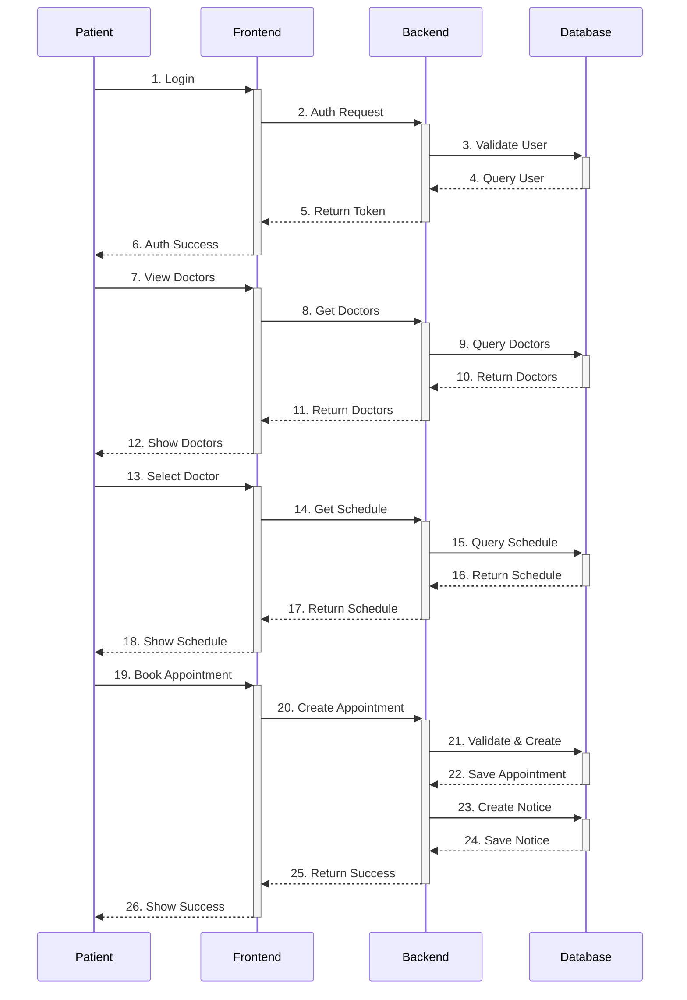
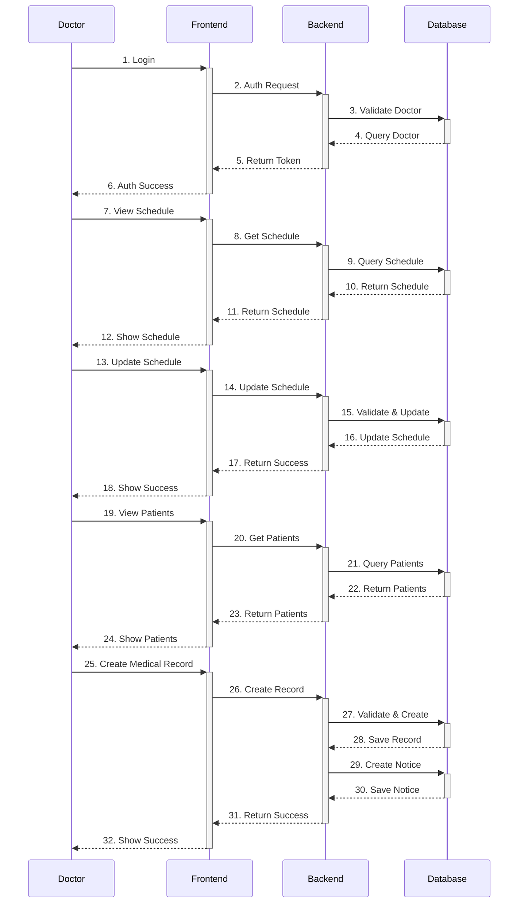
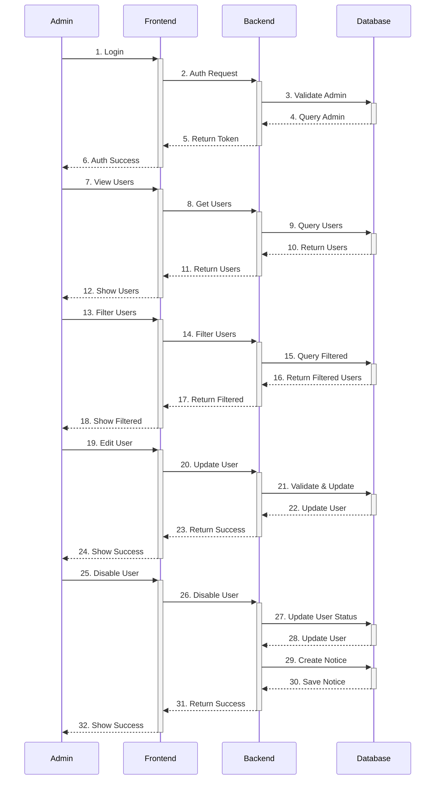
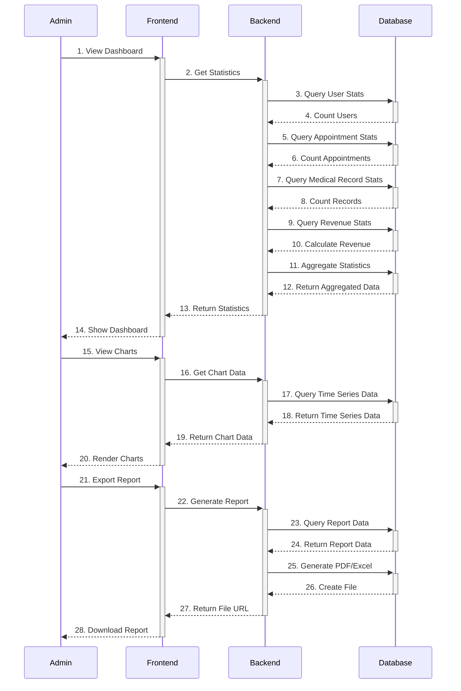

# Healthcare Appointment System - SYSML Diagrams

## 1. System Context Diagram (系统上下文图)

### 字符图表示

```
┌─────────────────────────────────────────────────────────────────┐
│                    Healthcare Appointment System                │
│                                                                 │
│  ┌─────────────────┐    ┌─────────────────┐    ┌─────────────┐  │
│  │   Patient       │    │   Doctor        │    │   Admin     │  │
│  │   (患者)        │    │   (医生)        │    │   (管理员)  │  │
│  │                 │    │                 │    │             │  │
│  │ • Register      │    │ • Manage        │    │ • Manage    │  │
│  │ • Login         │    │   Schedule      │    │   Users     │  │
│  │ • Book          │    │ • View          │    │ • View      │  │
│  │   Appointments  │    │   Appointments  │    │   Stats     │  │
│  │ • View Records  │    │ • Create        │    │ • Configure │  │
│  │ • Send Messages │    │   Records       │    │   System    │  │
│  │ • View Notices  │    │ • Reply         │    │ • Monitor   │  │
│  │                 │    │   Messages      │    │   System    │  │
│  │                 │    │ • View Notices  │    │             │  │
│  └─────────────────┘    └─────────────────┘    └─────────────┘  │
│           │                       │                       │      │
│           └───────────────────────┼───────────────────────┘      │
│                                   │                              │
│  ┌─────────────────────────────────────────────────────────────┐ │
│  │                    Core System                              │ │
│  │                                                             │ │
│  │  ┌─────────────┐  ┌─────────────┐  ┌─────────────┐        │ │
│  │  │   Auth      │  │ Appointment │  │ Medical     │        │ │
│  │  │   Module    │  │   Module    │  │ Record      │        │ │
│  │  │             │  │             │  │   Module    │        │ │
│  │  │ • Login     │  │ • Create    │  │ • Create    │        │ │
│  │  │ • Register  │  │ • Update    │  │ • View      │        │ │
│  │  │ • Profile   │  │ • Cancel    │  │ • Update    │        │ │
│  │  │ • Password  │  │ • Schedule  │  │ • Download  │        │ │
│  │  │             │  │ • Notify    │  │ • Upload    │        │ │
│  │  └─────────────┘  └─────────────┘  └─────────────┘        │ │
│  │                                                             │ │
│  │  ┌─────────────┐  ┌─────────────┐  ┌─────────────┐        │ │
│  │  │   Message   │  │   Notice    │  │   Admin     │        │ │
│  │  │   Module    │  │   Module    │  │   Module    │        │ │
│  │  │             │  │             │  │             │        │ │
│  │  │ • Send      │  │ • Create    │  │ • User      │        │ │
│  │  │ • Receive   │  │ • Read      │  │   Mgmt      │        │ │
│  │  │ • History   │  │ • Delete    │  │ • Stats     │        │ │
│  │  │ • Attach    │  │ • I18n      │  │ • Settings  │        │ │
│  │  └─────────────┘  └─────────────┘  └─────────────┘        │ │
│  └─────────────────────────────────────────────────────────────┘ │
└─────────────────────────────────────────────────────────────────┘
```

### Draw.io 绘制说明

1. **外部角色框**：使用圆角矩形，不同颜色区分

   - 患者：浅蓝色 (#E3F2FD)
   - 医生：浅绿色 (#E8F5E8)
   - 管理员：浅橙色 (#FFF3E0)
2. **核心系统框**：使用矩形，深色边框
3. **模块框**：使用圆角矩形，浅灰色背景
4. **连接线**：使用实线箭头，表示交互关系

---

## 2. Use Case Diagram (用例图)

### 字符图表示

```
┌─────────────────────────────────────────────────────────────────┐
│                    Healthcare Appointment System                │
│                                                                 │
│  ┌─────────────────┐    ┌─────────────────┐    ┌─────────────┐  │
│  │   Patient       │    │   Doctor        │    │   Admin     │  │
│  │                 │    │                 │    │             │  │
│  │ ○ Register      │    │ ○ Manage        │    │ ○ Manage    │  │
│  │ ○ Login         │    │   Schedule      │    │   Users     │  │
│  │ ○ View Profile  │    │ ○ View          │    │ ○ View      │  │
│  │ ○ Book          │    │   Appointments  │    │   Stats     │  │
│  │   Appointment   │    │ ○ Create        │    │ ○ Configure │  │
│  │ ○ Cancel        │    │   Medical       │    │   System    │  │
│  │   Appointment   │    │   Record        │    │ ○ Monitor   │  │
│  │ ○ View Medical  │    │ ○ Send Message  │    │   System    │  │
│  │   Records       │    │ ○ Reply Message │    │             │  │
│  │ ○ Send Message  │    │ ○ View Notices  │    │             │  │
│  │ ○ View Notices  │    │ ○ Update        │    │             │  │
│  │ ○ Download      │    │   Profile       │    │             │  │
│  │   Records       │    │                 │    │             │  │
│  └─────────────────┘    └─────────────────┘    └─────────────┘  │
│           │                       │                       │      │
│           └───────────────────────┼───────────────────────┘      │
│                                   │                              │
│  ┌─────────────────────────────────────────────────────────────┐ │
│  │                    System Boundary                          │ │
│  │                                                             │ │
│  │  ┌─────────────┐  ┌─────────────┐  ┌─────────────┐        │ │
│  │  │   Auth      │  │ Appointment │  │ Medical     │        │ │
│  │  │   System    │  │   System    │  │ Record      │        │ │
│  │  │             │  │             │  │   System    │        │ │
│  │  └─────────────┘  └─────────────┘  └─────────────┘        │ │
│  │                                                             │ │
│  │  ┌─────────────┐  ┌─────────────┐  ┌─────────────┐        │ │
│  │  │   Message   │  │   Notice    │  │   Admin     │        │ │
│  │  │   System    │  │   System    │  │   System    │        │ │
│  │  │             │  │             │  │             │        │ │
│  │  └─────────────┘  └─────────────┘  └─────────────┘        │ │
│  └─────────────────────────────────────────────────────────────┘ │
└─────────────────────────────────────────────────────────────────┘
```

### Draw.io 绘制说明

1. **角色**：使用小人图标 (Actor)
2. **用例**：使用椭圆，白色背景
3. **系统边界**：使用矩形，虚线边框
4. **关联关系**：使用实线连接角色和用例
5. **包含关系**：使用虚线箭头，标注 <`<include>`>
6. **扩展关系**：使用虚线箭头，标注 <`<extend>`>

---

## 3. Class Diagram (类图)

### 字符图表示

```
┌─────────────────────────────────────────────────────────────────┐
│                           User                                  │
├─────────────────────────────────────────────────────────────────┤
│ - _id: ObjectId                                                 │
│ - name: String                                                  │
│ - email: String                                                 │
│ - password: String                                              │
│ - role: String (patient|doctor|admin)                          │
│ - phone: String                                                 │
│ - address: String                                               │
│ - dateOfBirth: Date                                             │
│ - gender: String                                                │
│ - specialization: String                                        │
│ - department: String                                            │
│ - licenseNumber: String                                         │
│ - experience: Number                                            │
│ - education: String                                             │
│ - bio: String                                                   │
│ - emergencyContact: Object                                      │
│ - medicalHistory: [String]                                      │
│ - allergies: [String]                                           │
│ - avatar: String                                                │
│ - isActive: Boolean                                             │
│ - lastLogin: Date                                               │
│ - createdAt: Date                                               │
│ - updatedAt: Date                                               │
├─────────────────────────────────────────────────────────────────┤
│ + matchPassword(enteredPassword): Boolean                      │
│ + generateAuthToken(): String                                  │
└─────────────────────────────────────────────────────────────────┘
                                │
                                │ 1
                                │
┌─────────────────────────────────────────────────────────────────┐
│                       Appointment                               │
├─────────────────────────────────────────────────────────────────┤
│ - _id: ObjectId                                                 │
│ - patient: ObjectId (ref: User)                                │
│ - doctor: ObjectId (ref: User)                                 │
│ - date: Date                                                    │
│ - timeSlot: String                                              │
│ - status: String (pending|confirmed|cancelled|completed|no-show)│
│ - type: String (consultation|follow-up|emergency|routine)      │
│ - symptoms: String                                              │
│ - notes: String                                                 │
│ - cancellationReason: String                                   │
│ - cancelledBy: ObjectId (ref: User)                            │
│ - cancelledAt: Date                                             │
│ - reminderSent: Boolean                                         │
│ - createdAt: Date                                               │
│ - updatedAt: Date                                               │
├─────────────────────────────────────────────────────────────────┤
│ + updateStatus(newStatus): void                                │
│ + cancel(reason, cancelledBy): void                            │
└─────────────────────────────────────────────────────────────────┘
                                │
                                │ 1
                                │
┌─────────────────────────────────────────────────────────────────┐
│                    MedicalRecord                                │
├─────────────────────────────────────────────────────────────────┤
│ - _id: ObjectId                                                 │
│ - patient: ObjectId (ref: User)                                │
│ - doctor: ObjectId (ref: User)                                 │
│ - appointment: ObjectId (ref: Appointment)                     │
│ - visitDate: Date                                               │
│ - symptoms: String                                              │
│ - diagnosis: String                                             │
│ - treatment: String                                             │
│ - prescription: Object                                          │
│ - vitalSigns: Object                                            │
│ - labResults: [Object]                                          │
│ - attachments: [Object]                                         │
│ - notes: String                                                 │
│ - followUpDate: Date                                            │
│ - followUpNotes: String                                         │
│ - isActive: Boolean                                             │
│ - createdAt: Date                                               │
│ - updatedAt: Date                                               │
├─────────────────────────────────────────────────────────────────┤
│ + addAttachment(file): void                                    │
│ + updateVitalSigns(signs): void                                │
│ + addLabResult(result): void                                   │
└─────────────────────────────────────────────────────────────────┘

┌─────────────────────────────────────────────────────────────────┐
│                      DoctorSchedule                             │
├─────────────────────────────────────────────────────────────────┤
│ - _id: ObjectId                                                 │
│ - doctor: ObjectId (ref: User)                                 │
│ - date: Date                                                    │
│ - timeSlots: [Object]                                           │
│ - isWorkingDay: Boolean                                         │
│ - notes: String                                                 │
│ - maxAppointments: Number                                       │
│ - createdAt: Date                                               │
│ - updatedAt: Date                                               │
├─────────────────────────────────────────────────────────────────┤
│ + addTimeSlot(time, isAvailable): void                         │
│ + updateTimeSlot(time, isAvailable): void                      │
│ + getAvailableSlots(): [String]                                │
└─────────────────────────────────────────────────────────────────┘
                                │
                                │ 1
                                │
┌─────────────────────────────────────────────────────────────────┐
│                         Notice                                  │
├─────────────────────────────────────────────────────────────────┤
│ - _id: ObjectId                                                 │
│ - recipientId: ObjectId (ref: User)                            │
│ - senderId: ObjectId (ref: User)                               │
│ - type: String                                                  │
│ - title: String                                                 │
│ - content: String                                               │
│ - relatedId: ObjectId                                           │
│ - relatedType: String                                           │
│ - isRead: Boolean                                               │
│ - isActive: Boolean                                             │
│ - createdAt: Date                                               │
│ - updatedAt: Date                                               │
├─────────────────────────────────────────────────────────────────┤
│ + markAsRead(): void                                           │
│ + createAppointmentRequest(): Notice                           │
│ + createAppointmentConfirmed(): Notice                         │
│ + createMedicalRecordAdded(): Notice                           │
│ + createNewMessage(): Notice                                   │
└─────────────────────────────────────────────────────────────────┘
```

### Draw.io 绘制说明

1. **类框**：使用矩形，分为三部分

   - 类名：粗体，居中
   - 属性：左对齐，- 表示私有，+ 表示公有
   - 方法：左对齐，+ 表示公有
2. **关系线**：

   - 关联关系：实线箭头
   - 继承关系：空心三角形箭头
   - 聚合关系：空心菱形箭头
   - 组合关系：实心菱形箭头
3. **多重性**：

   - 1：一对一
   - *：多对多
   - 1..*：一对多

---

## 4. Sequence Diagram - Patient Appointment Booking (患者预约流程时序图)

### 字符图表示

```
Patient          Frontend         Backend         Database
  │                   │               │               │
  │ 1. Login          │               │               │
  │───────────────────│───────────────│               │
  │                   │ 2. Auth       │               │
  │                   │ Request       │               │
  │                   │───────────────│               │
  │                   │               │ 3. Validate   │
  │                   │               │ User          │
  │                   │               │───────────────│
  │                   │               │               │ 4. Query User
  │                   │               │               │◄────────────
  │                   │               │ 5. Return     │
  │                   │               │ Token         │
  │                   │ 6. Auth       │◄──────────────│
  │                   │ Success       │               │
  │ 7. View Doctors   │◄──────────────│               │
  │───────────────────│               │               │
  │                   │ 8. Get        │               │
  │                   │ Doctors       │               │
  │                   │───────────────│               │
  │                   │               │ 9. Query      │
  │                   │               │ Doctors       │
  │                   │               │───────────────│
  │                   │               │               │ 10. Return
  │                   │               │               │ Doctors
  │                   │               │ 11. Return    │◄────────────
  │                   │               │ Doctors       │
  │                   │ 12. Show      │◄──────────────│
  │                   │ Doctors       │               │
  │ 13. Select        │◄──────────────│               │
  │ Doctor            │               │               │
  │───────────────────│               │               │
  │                   │ 14. Get       │               │
  │                   │ Schedule      │               │
  │                   │───────────────│               │
  │                   │               │ 15. Query     │
  │                   │               │ Schedule      │
  │                   │               │───────────────│
  │                   │               │               │ 16. Return
  │                   │               │               │ Schedule
  │                   │               │ 17. Return    │◄────────────
  │                   │               │ Schedule      │
  │                   │ 18. Show      │◄──────────────│
  │                   │ Schedule      │               │
  │ 19. Book          │◄──────────────│               │
  │ Appointment       │               │               │
  │───────────────────│               │               │
  │                   │ 20. Create    │               │
  │                   │ Appointment   │               │
  │                   │───────────────│               │
  │                   │               │ 21. Validate  │
  │                   │               │ & Create      │
  │                   │               │───────────────│
  │                   │               │               │ 22. Save
  │                   │               │               │ Appointment
  │                   │               │               │◄────────────
  │                   │               │ 23. Create    │
  │                   │               │ Notice        │
  │                   │               │───────────────│
  │                   │               │               │ 24. Save
  │                   │               │               │ Notice
  │                   │               │               │◄────────────
  │                   │               │ 25. Return    │
  │                   │               │ Success       │
  │                   │ 26. Show      │◄──────────────│
  │                   │ Success       │               │
  │ 27. Confirmation  │◄──────────────│               │
  │───────────────────│               │               │
```

### Mermaid 代码表示



---

## 5. Sequence Diagram - Doctor Schedule Management (医生排班管理时序图)

### 字符图表示

```
Doctor           Frontend         Backend         Database
  │                   │               │               │
  │ 1. Login          │               │               │
  │───────────────────│───────────────│               │
  │                   │ 2. Auth       │               │
  │                   │ Request       │               │
  │                   │───────────────│               │
  │                   │               │ 3. Validate   │
  │                   │               │ Doctor        │
  │                   │               │───────────────│
  │                   │               │               │ 4. Query Doctor
  │                   │               │               │◄────────────
  │                   │               │ 5. Return     │
  │                   │               │ Token         │
  │                   │ 6. Auth       │◄──────────────│
  │                   │ Success       │               │
  │ 7. View Schedule  │◄──────────────│               │
  │───────────────────│               │               │
  │                   │ 8. Get        │               │
  │                   │ Schedule      │               │
  │                   │───────────────│               │
  │                   │               │ 9. Query      │
  │                   │               │ Schedule      │
  │                   │               │───────────────│
  │                   │               │               │ 10. Return
  │                   │               │               │ Schedule
  │                   │               │ 11. Return    │◄────────────
  │                   │               │ Schedule      │
  │                   │ 12. Show      │◄──────────────│
  │                   │ Schedule      │               │
  │ 13. Update        │◄──────────────│               │
  │ Schedule          │               │               │
  │───────────────────│               │               │
  │                   │ 14. Update    │               │
  │                   │ Schedule      │               │
  │                   │───────────────│               │
  │                   │               │ 15. Validate  │
  │                   │               │ & Update      │
  │                   │               │───────────────│
  │                   │               │               │ 16. Update
  │                   │               │               │ Schedule
  │                   │               │               │◄────────────
  │                   │               │ 17. Return    │
  │                   │               │ Success       │
  │                   │ 18. Show      │◄──────────────│
  │                   │ Success       │               │
  │ 19. View          │◄──────────────│               │
  │ Patients          │               │               │
  │───────────────────│               │               │
  │                   │ 20. Get       │               │
  │                   │ Patients      │               │
  │                   │───────────────│               │
  │                   │               │ 21. Query     │
  │                   │               │ Patients      │
  │                   │               │───────────────│
  │                   │               │               │ 22. Return
  │                   │               │               │ Patients
  │                   │               │ 23. Return    │◄────────────
  │                   │               │ Patients      │
  │                   │ 24. Show      │◄──────────────│
  │                   │ Patients      │               │
  │ 25. Create        │◄──────────────│               │
  │ Medical Record    │               │               │
  │───────────────────│               │               │
  │                   │ 26. Create    │               │
  │                   │ Record        │               │
  │                   │───────────────│               │
  │                   │               │ 27. Validate  │
  │                   │               │ & Create      │
  │                   │               │───────────────│
  │                   │               │               │ 28. Save
  │                   │               │               │ Record
  │                   │               │               │◄────────────
  │                   │               │ 29. Create    │
  │                   │               │ Notice        │
  │                   │               │───────────────│
  │                   │               │               │ 30. Save
  │                   │               │               │ Notice
  │                   │               │               │◄────────────
  │                   │               │ 31. Return    │
  │                   │               │ Success       │
  │                   │ 32. Show      │◄──────────────│
  │                   │ Success       │               │
  │ 33. Record        │◄──────────────│               │
  │ Created           │               │               │
  │───────────────────│               │               │
```

### Mermaid 代码表示



---

## 6. Sequence Diagram - Admin User Management (管理员用户管理时序图)

### 字符图表示

```
Admin            Frontend         Backend         Database
  │                   │               │               │
  │ 1. Login          │               │               │
  │───────────────────│───────────────│               │
  │                   │ 2. Auth       │               │
  │                   │ Request       │               │
  │                   │───────────────│               │
  │                   │               │ 3. Validate   │
  │                   │               │ Admin         │
  │                   │               │───────────────│
  │                   │               │               │ 4. Query Admin
  │                   │               │               │◄────────────
  │                   │               │ 5. Return     │
  │                   │               │ Token         │
  │                   │ 6. Auth       │◄──────────────│
  │                   │ Success       │               │
  │ 7. View Users     │◄──────────────│               │
  │───────────────────│               │               │
  │                   │ 8. Get        │               │
  │                   │ Users         │               │
  │                   │───────────────│               │
  │                   │               │ 9. Query      │
  │                   │               │ Users         │
  │                   │               │───────────────│
  │                   │               │               │ 10. Return
  │                   │               │               │ Users
  │                   │               │ 11. Return    │◄────────────
  │                   │               │ Users         │
  │                   │ 12. Show      │◄──────────────│
  │                   │ Users         │               │
  │ 13. Filter        │◄──────────────│               │
  │ Users             │               │               │
  │───────────────────│               │               │
  │                   │ 14. Filter    │               │
  │                   │ Users         │               │
  │                   │───────────────│               │
  │                   │               │ 15. Query     │
  │                   │               │ Filtered      │
  │                   │               │───────────────│
  │                   │               │               │ 16. Return
  │                   │               │               │ Filtered
  │                   │               │               │ Users
  │                   │               │ 17. Return    │◄────────────
  │                   │               │ Filtered      │
  │                   │ 18. Show      │◄──────────────│
  │                   │ Filtered      │               │
  │ 19. Edit User     │◄──────────────│               │
  │───────────────────│               │               │
  │                   │ 20. Update    │               │
  │                   │ User          │               │
  │                   │───────────────│               │
  │                   │               │ 21. Validate  │
  │                   │               │ & Update      │
  │                   │               │───────────────│
  │                   │               │               │ 22. Update
  │                   │               │               │ User
  │                   │               │               │◄────────────
  │                   │               │ 23. Return    │
  │                   │               │ Success       │
  │                   │ 24. Show      │◄──────────────│
  │                   │ Success       │               │
  │ 25. Disable       │◄──────────────│               │
  │ User              │               │               │
  │───────────────────│               │               │
  │                   │ 26. Disable   │               │
  │                   │ User          │               │
  │                   │───────────────│               │
  │                   │               │ 27. Update    │
  │                   │               │ User Status   │
  │                   │               │───────────────│
  │                   │               │               │ 28. Update
  │                   │               │               │ User
  │                   │               │               │◄────────────
  │                   │               │ 29. Create    │
  │                   │               │ Notice        │
  │                   │               │───────────────│
  │                   │               │               │ 30. Save
  │                   │               │               │ Notice
  │                   │               │               │◄────────────
  │                   │               │ 31. Return    │
  │                   │               │ Success       │
  │                   │ 32. Show      │◄──────────────│
  │                   │ Success       │               │
  │ 33. User          │◄──────────────│               │
  │ Disabled          │               │               │
  │───────────────────│               │               │
```

### Mermaid 代码表示



---

## 7. Sequence Diagram - Admin System Statistics (管理员系统统计时序图)

### 字符图表示

```
Admin            Frontend         Backend         Database
  │                   │               │               │
  │ 1. View Dashboard │               │               │
  │───────────────────│               │               │
  │                   │ 2. Get        │               │
  │                   │ Statistics    │               │
  │                   │───────────────│               │
  │                   │               │ 3. Query      │
  │                   │               │ User Stats    │
  │                   │               │───────────────│
  │                   │               │               │ 4. Count Users
  │                   │               │               │◄────────────
  │                   │               │ 5. Query      │
  │                   │               │ Appointment   │
  │                   │               │ Stats         │
  │                   │               │───────────────│
  │                   │               │               │ 6. Count
  │                   │               │               │ Appointments
  │                   │               │               │◄────────────
  │                   │               │ 7. Query      │
  │                   │               │ Medical       │
  │                   │               │ Record Stats  │
  │                   │               │───────────────│
  │                   │               │               │ 8. Count
  │                   │               │               │ Records
  │                   │               │               │◄────────────
  │                   │               │ 9. Query      │
  │                   │               │ Revenue       │
  │                   │               │ Stats         │
  │                   │               │───────────────│
  │                   │               │               │ 10. Calculate
  │                   │               │               │ Revenue
  │                   │               │               │◄────────────
  │                   │               │ 11. Aggregate │
  │                   │               │ Statistics    │
  │                   │               │───────────────│
  │                   │               │               │ 12. Return
  │                   │               │               │ Aggregated
  │                   │               │               │ Data
  │                   │               │ 13. Return    │◄────────────
  │                   │               │ Statistics    │
  │                   │ 14. Show      │◄──────────────│
  │                   │ Dashboard     │               │
  │ 15. View Charts   │◄──────────────│               │
  │───────────────────│               │               │
  │                   │ 16. Get       │               │
  │                   │ Chart Data    │               │
  │                   │───────────────│               │
  │                   │               │ 17. Query     │
  │                   │               │ Time Series   │
  │                   │               │ Data          │
  │                   │               │───────────────│
  │                   │               │               │ 18. Return
  │                   │               │               │ Time Series
  │                   │               │               │ Data
  │                   │               │ 19. Return    │◄────────────
  │                   │               │ Chart Data    │
  │                   │ 20. Render    │◄──────────────│
  │                   │ Charts        │               │
  │ 21. Export        │◄──────────────│               │
  │ Report            │               │               │
  │───────────────────│               │               │
  │                   │ 22. Generate  │               │
  │                   │ Report        │               │
  │                   │───────────────│               │
  │                   │               │ 23. Query     │
  │                   │               │ Report Data   │
  │                   │               │───────────────│
  │                   │               │               │ 24. Return
  │                   │               │               │ Report Data
  │                   │               │ 25. Generate  │◄────────────
  │                   │               │ PDF/Excel     │
  │                   │               │───────────────│
  │                   │               │               │ 26. Create
  │                   │               │               │ File
  │                   │               │               │◄────────────
  │                   │               │ 27. Return    │
  │                   │               │ File URL      │
  │                   │ 28. Download  │◄──────────────│
  │                   │ Report        │               │
  │ 29. Report        │◄──────────────│               │
  │ Downloaded        │               │               │
  │───────────────────│               │               │
```

### Mermaid 代码表示



### Draw.io 绘制说明

1. **生命线**：使用垂直线，顶部放置参与者名称
2. **激活框**：在生命线上使用细长矩形表示激活状态
3. **消息箭头**：
   - 同步消息：实线箭头
   - 异步消息：虚线箭头
   - 返回消息：虚线箭头
4. **注释框**：使用矩形，虚线边框，用于说明

---

## 5.1 Doctor Schedule Management - Draw.io 绘制说明

### 参与者颜色方案

- **Doctor**：浅绿色 (#E8F5E8)
- **Frontend**：浅蓝色 (#E3F2FD)
- **Backend**：浅橙色 (#FFF3E0)
- **Database**：浅灰色 (#F5F5F5)

### 关键交互点

1. **认证流程**：步骤1-6，使用激活框突出显示
2. **排班管理**：步骤7-18，使用不同颜色区分操作
3. **患者管理**：步骤19-24，使用图标标识
4. **病历创建**：步骤25-33，使用特殊标记

### 消息标注

- **同步请求**：实线箭头，标注请求内容
- **数据库查询**：虚线箭头，标注查询类型
- **响应消息**：虚线箭头，标注响应状态
- **错误处理**：红色虚线箭头，标注错误类型

---

## 6.1 Admin User Management - Draw.io 绘制说明

### 参与者颜色方案

- **Admin**：深橙色 (#FF9800)
- **Frontend**：浅蓝色 (#E3F2FD)
- **Backend**：浅橙色 (#FFF3E0)
- **Database**：浅灰色 (#F5F5F5)

### 关键交互点

1. **管理员认证**：步骤1-6，使用特殊图标
2. **用户列表**：步骤7-12，使用表格图标
3. **用户筛选**：步骤13-18，使用过滤器图标
4. **用户编辑**：步骤19-24，使用编辑图标
5. **用户禁用**：步骤25-33，使用警告图标

### 权限控制

- **管理员权限验证**：在每个操作前验证
- **用户状态管理**：使用状态图标标识
- **操作日志**：记录所有管理操作

---

## 7.1 Admin System Statistics - Draw.io 绘制说明

### 参与者颜色方案

- **Admin**：深橙色 (#FF9800)
- **Frontend**：浅蓝色 (#E3F2FD)
- **Backend**：浅橙色 (#FFF3E0)
- **Database**：浅灰色 (#F5F5F5)

### 统计数据类型

1. **用户统计**：步骤3-4，使用用户图标
2. **预约统计**：步骤5-6，使用日历图标
3. **病历统计**：步骤7-8，使用文档图标
4. **收入统计**：步骤9-10，使用货币图标

### 图表渲染

- **实时数据**：使用动态图标
- **图表类型**：柱状图、折线图、饼图
- **数据导出**：PDF、Excel格式支持

---

## 8. Activity Diagram - User Registration (用户注册活动图)

### 字符图表示

```
┌─────────────────────────────────────────────────────────────────┐
│                    Start                                        │
└─────────────────────┬───────────────────────────────────────────┘
                      │
                      ▼
┌─────────────────────────────────────────────────────────────────┐
│              Fill Registration Form                             │
│                                                                 │
│  • Name                                                         │
│  • Email                                                        │
│  • Password                                                     │
│  • Role (Patient/Doctor)                                        │
│  • Phone                                                        │
│  • Address                                                      │
│  • Date of Birth                                                │
│  • Gender                                                       │
└─────────────────────┬───────────────────────────────────────────┘
                      │
                      ▼
┌─────────────────────────────────────────────────────────────────┐
│              Validate Form Data                                 │
└─────────────────────┬───────────────────────────────────────────┘
                      │
                      ▼
┌─────────────────────────────────────────────────────────────────┐
│              Email Already Exists?                              │
└─────────────────────┬───────────────────────────────────────────┘
                      │ Yes
                      ▼
┌─────────────────────────────────────────────────────────────────┐
│              Show Error Message                                 │
└─────────────────────┬───────────────────────────────────────────┘
                      │
                      ▼
┌─────────────────────────────────────────────────────────────────┐
│              Return to Form                                     │
└─────────────────────┬───────────────────────────────────────────┘
                      │
                      ▼
┌─────────────────────────────────────────────────────────────────┐
│              Hash Password                                      │
└─────────────────────┬───────────────────────────────────────────┘
                      │
                      ▼
┌─────────────────────────────────────────────────────────────────┐
│              Create User Record                                 │
└─────────────────────┬───────────────────────────────────────────┘
                      │
                      ▼
┌─────────────────────────────────────────────────────────────────┐
│              Generate Auth Token                                │
└─────────────────────┬───────────────────────────────────────────┘
                      │
                      ▼
┌─────────────────────────────────────────────────────────────────┐
│              Send Welcome Email                                 │
└─────────────────────┬───────────────────────────────────────────┘
                      │
                      ▼
┌─────────────────────────────────────────────────────────────────┐
│              Redirect to Dashboard                              │
└─────────────────────┬───────────────────────────────────────────┘
                      │
                      ▼
┌─────────────────────────────────────────────────────────────────┐
│                    End                                          │
└─────────────────────────────────────────────────────────────────┘
```

### Draw.io 绘制说明

1. **开始/结束节点**：使用圆形/实心圆
2. **活动节点**：使用圆角矩形
3. **决策节点**：使用菱形
4. **连接线**：使用实线箭头
5. **分支/合并**：使用粗线
6. **注释**：使用矩形，虚线边框

---

## 9. Component Diagram (组件图)

### 字符图表示

```
┌─────────────────────────────────────────────────────────────────┐
│                    Healthcare Appointment System                │
│                                                                 │
│  ┌─────────────────────────────────────────────────────────────┐ │
│  │                    Frontend (React)                        │ │
│  │                                                             │ │
│  │  ┌─────────────┐  ┌─────────────┐  ┌─────────────┐        │ │
│  │  │   Auth      │  │   Patient   │  │   Doctor    │        │ │
│  │  │   Module    │  │   Module    │  │   Module    │        │ │
│  │  │             │  │             │  │             │        │ │
│  │  │ • Login     │  │ • Dashboard │  │ • Dashboard │        │ │
│  │  │ • Register  │  │ • Appointments│ │ • Schedule  │        │ │
│  │  │ • Profile   │  │ • Records   │  │ • Patients  │        │ │
│  │  │ • Password  │  │ • Messages  │  │ • Records   │        │ │
│  │  │             │  │ • Notices   │  │ • Messages  │        │ │
│  │  └─────────────┘  └─────────────┘  └─────────────┘        │ │
│  │                                                             │ │
│  │  ┌─────────────┐  ┌─────────────┐  ┌─────────────┐        │ │
│  │  │   Admin     │  │   Shared    │  │   Utils     │        │ │
│  │  │   Module    │  │   Components│  │   Module    │        │ │
│  │  │             │  │             │  │             │        │ │
│  │  │ • Dashboard │  │ • Navbar    │  │ • i18n      │        │ │
│  │  │ • Users     │  │ • NoticeBell│  │ • axios     │        │ │
│  │  │ • Appointments│ │ • Forms     │  │ • debug     │        │ │
│  │  │ • Records   │  │ • Tables    │  │ • date-fns  │        │ │
│  │  │ • Settings  │  │ • Modals    │  │             │        │ │
│  │  └─────────────┘  └─────────────┘  └─────────────┘        │ │
│  └─────────────────────────────────────────────────────────────┘ │
│                              │                                  │
│                              │ HTTP/HTTPS                       │
│                              ▼                                  │
│  ┌─────────────────────────────────────────────────────────────┐ │
│  │                    Backend (Node.js)                       │ │
│  │                                                             │ │
│  │  ┌─────────────┐  ┌─────────────┐  ┌─────────────┐        │ │
│  │  │   Auth      │  │ Appointment │  │ Medical     │        │ │
│  │  │   Controller│  │ Controller  │  │ Record      │        │ │
│  │  │             │  │             │  │ Controller  │        │ │
│  │  │ • Login     │  │ • Create    │  │ • Create    │        │ │
│  │  │ • Register  │  │ • Update    │  │ • View      │        │ │
│  │  │ • Profile   │  │ • Cancel    │  │ • Update    │        │ │
│  │  │ • Password  │  │ • Schedule  │  │ • Download  │        │ │
│  │  │             │  │ • Notify    │  │ • Upload    │        │ │
│  │  └─────────────┘  └─────────────┘  └─────────────┘        │ │
│  │                                                             │ │
│  │  ┌─────────────┐  ┌─────────────┐  ┌─────────────┐        │ │
│  │  │   Message   │  │   Notice    │  │   Admin     │        │ │
│  │  │   Controller│  │ Controller  │  │ Controller  │        │ │
│  │  │             │  │             │  │             │        │ │
│  │  │ • Send      │  │ • Create    │  │ • User      │        │ │
│  │  │ • Receive   │  │ • Read      │  │   Mgmt      │        │ │
│  │  │ • History   │  │ • Delete    │  │ • Stats     │        │ │
│  │  │ • Attach    │  │ • I18n      │  │ • Settings  │        │ │
│  │  └─────────────┘  └─────────────┘  └─────────────┘        │ │
│  │                                                             │ │
│  │  ┌─────────────┐  ┌─────────────┐  ┌─────────────┐        │ │
│  │  │   Routes    │  │   Middleware│  │   Utils     │        │ │
│  │  │   Module    │  │   Module    │  │   Module    │        │ │
│  │  │             │  │             │  │             │        │ │
│  │  │ • Auth      │  │ • Auth      │  │ • i18n      │        │ │
│  │  │ • Appointment│ │ • Role      │  │ • Validation│        │ │
│  │  │ • Medical   │  │ • Error     │  │ • Database  │        │ │
│  │  │ • Message   │  │ • Logging   │  │ • Backup    │        │ │
│  │  │ • Admin     │  │             │  │             │        │ │
│  │  └─────────────┘  └─────────────┘  └─────────────┘        │ │
│  └─────────────────────────────────────────────────────────────┘ │
│                              │                                  │
│                              │ MongoDB                          │
│                              ▼                                  │
│  ┌─────────────────────────────────────────────────────────────┐ │
│  │                    Database (MongoDB)                       │ │
│  │                                                             │ │
│  │  ┌─────────────┐  ┌─────────────┐  ┌─────────────┐        │ │
│  │  │   Users     │  │ Appointments│  │ Medical     │        │ │
│  │  │   Collection│  │ Collection  │  │ Records     │        │ │
│  │  │             │  │             │  │ Collection  │        │ │
│  │  │ • Patients  │  │ • Pending   │  │ • Patient   │        │ │
│  │  │ • Doctors   │  │ • Confirmed │  │   Records   │        │ │
│  │  │ • Admins    │  │ • Cancelled │  │ • Doctor    │        │ │
│  │  │ • Profiles  │  │ • Completed │  │   Notes     │        │ │
│  │  │ • Settings  │  │ • Schedule  │  │ • Attachments│       │ │
│  │  └─────────────┘  └─────────────┘  └─────────────┘        │ │
│  │                                                             │ │
│  │  ┌─────────────┐  ┌─────────────┐  ┌─────────────┐        │ │
│  │  │   Messages  │  │   Notices   │  │ Doctor      │        │ │
│  │  │ Collection  │  │ Collection  │  │ Schedules   │        │ │
│  │  │             │  │             │  │ Collection  │        │ │
│  │  │ • Text      │  │ • System    │  │ • Daily     │        │ │
│  │  │ • Image     │  │ • User      │  │   Slots     │        │ │
│  │  │ • File      │  │ • Read      │  │ • Available │        │ │
│  │  │ • System    │  │ • Unread    │  │ • Booked    │        │ │
│  │  │ • History   │  │ • I18n      │  │ • Notes     │        │ │
│  │  └─────────────┘  └─────────────┘  └─────────────┘        │ │
│  └─────────────────────────────────────────────────────────────┘ │
└─────────────────────────────────────────────────────────────────┘
```

### Draw.io 绘制说明

1. **组件框**：使用矩形，圆角
2. **接口**：使用小圆圈，连接组件
3. **依赖关系**：使用虚线箭头
4. **关联关系**：使用实线箭头
5. **端口**：使用矩形，连接组件和接口

---

## 10. Deployment Diagram (部署图)

### 字符图表示

```
┌─────────────────────────────────────────────────────────────────┐
│                    Production Environment                       │
│                                                                 │
│  ┌─────────────────────────────────────────────────────────────┐ │
│  │                    Load Balancer                            │ │
│  │                    (Nginx)                                  │ │
│  │                                                             │ │
│  │  • SSL Termination                                          │ │
│  │  • Static File Serving                                      │ │
│  │  • Reverse Proxy                                            │ │
│  │  • Rate Limiting                                            │ │
│  └─────────────────────────────────────────────────────────────┘ │
│                              │                                  │
│                              │ HTTP/HTTPS                       │
│                              ▼                                  │
│  ┌─────────────────────────────────────────────────────────────┐ │
│  │                    Web Server                               │ │
│  │                    (Port 3000)                              │ │
│  │                                                             │ │
│  │  ┌─────────────────────────────────────────────────────────┐ │ │
│  │  │                React Frontend                           │ │ │
│  │  │                                                         │ │ │
│  │  │  • Static Files                                         │ │ │
│  │  │  • JavaScript Bundle                                    │ │ │
│  │  │  • CSS Styles                                           │ │ │
│  │  │  • Images & Icons                                       │ │ │
│  │  │  • Service Worker                                       │ │ │
│  │  └─────────────────────────────────────────────────────────┘ │ │
│  └─────────────────────────────────────────────────────────────┘ │
│                              │                                  │
│                              │ API Calls                        │
│                              ▼                                  │
│  ┌─────────────────────────────────────────────────────────────┐ │
│  │                    API Server                               │ │
│  │                    (Port 5001)                              │ │
│  │                                                             │ │
│  │  ┌─────────────────────────────────────────────────────────┐ │ │
│  │  │                Node.js Backend                          │ │ │
│  │  │                                                         │ │ │
│  │  │  • Express Server                                       │ │ │
│  │  │  • JWT Authentication                                   │ │ │
│  │  │  • File Upload Handler                                  │ │ │
│  │  │  • Email Service                                        │ │ │
│  │  │  • Logging Service                                      │ │ │
│  │  │  • Backup Service                                       │ │ │
│  │  └─────────────────────────────────────────────────────────┘ │ │
│  └─────────────────────────────────────────────────────────────┘ │
│                              │                                  │
│                              │ Database Connection              │
│                              ▼                                  │
│  ┌─────────────────────────────────────────────────────────────┐ │
│  │                    Database Server                          │ │
│  │                    (Port 27017)                             │ │
│  │                                                             │ │
│  │  ┌─────────────────────────────────────────────────────────┐ │ │
│  │  │                MongoDB Database                          │ │ │
│  │  │                                                         │ │ │
│  │  │  • Users Collection                                     │ │ │
│  │  │  • Appointments Collection                              │ │ │
│  │  │  • Medical Records Collection                           │ │ │
│  │  │  • Messages Collection                                  │ │ │
│  │  │  • Notices Collection                                   │ │ │
│  │  │  • Doctor Schedules Collection                          │ │ │
│  │  │  • File Storage                                         │ │ │
│  │  │  • Backup Storage                                       │ │ │
│  │  └─────────────────────────────────────────────────────────┘ │ │
│  └─────────────────────────────────────────────────────────────┘ │
│                                                                 │
│  ┌─────────────────────────────────────────────────────────────┐ │
│  │                    External Services                        │ │
│  │                                                             │ │
│  │  ┌─────────────┐  ┌─────────────┐  ┌─────────────┐        │ │
│  │  │   Email     │  │   File      │  │   Backup    │        │ │
│  │  │   Service   │  │   Storage   │  │   Service   │        │ │
│  │  │             │  │             │  │             │        │ │
│  │  │ • SMTP      │  │ • Local     │  │ • Automated │        │ │
│  │  │ • Templates │  │ • Cloud     │  │ • Scheduled │        │ │
│  │  │ • Notifications│ │ • CDN      │  │ • Recovery  │        │ │
│  │  └─────────────┘  └─────────────┘  └─────────────┘        │ │
│  └─────────────────────────────────────────────────────────────┘ │
└─────────────────────────────────────────────────────────────────┘
```

### Draw.io 绘制说明

1. **节点**：使用立方体表示物理设备
2. **组件**：使用矩形，圆角
3. **连接线**：使用实线，标注协议和端口
4. **网络**：使用云形图标
5. **数据库**：使用圆柱形图标

---

## 图例说明 (Legend)

### 基本图形

- **矩形**：类、组件、活动
- **圆角矩形**：用例、组件
- **椭圆**：用例
- **菱形**：决策点
- **圆形**：开始/结束点
- **立方体**：节点/设备
- **圆柱**：数据库
- **云形**：网络/外部系统

### 连接线

- **实线箭头**：关联关系、同步消息
- **虚线箭头**：依赖关系、异步消息、返回消息
- **空心菱形箭头**：聚合关系
- **实心菱形箭头**：组合关系
- **空心三角形箭头**：继承关系

### 颜色方案

- **蓝色系**：前端相关 (#E3F2FD, #2196F3)
- **绿色系**：后端相关 (#E8F5E8, #4CAF50)
- **橙色系**：数据库相关 (#FFF3E0, #FF9800)
- **紫色系**：外部服务 (#F3E5F5, #9C27B0)
- **灰色系**：基础设施 (#F5F5F5, #757575)

### 字体规范

- **标题**：16pt, 粗体
- **类名/组件名**：14pt, 粗体
- **属性/方法**：12pt, 常规
- **注释**：10pt, 斜体

这些图表完整描述了医疗预约系统的架构、数据流和部署结构，可以直接在draw.io中绘制使用。
