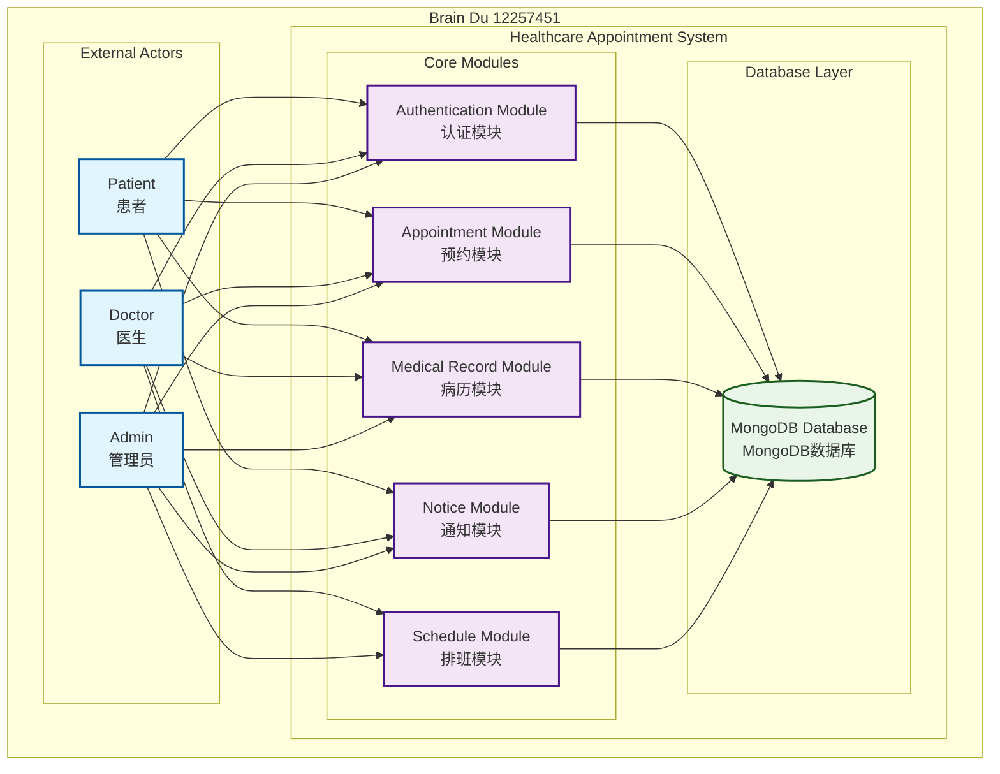
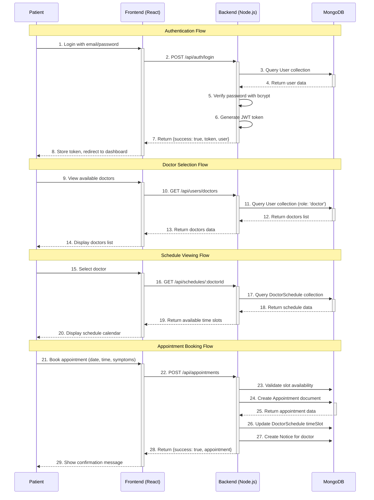
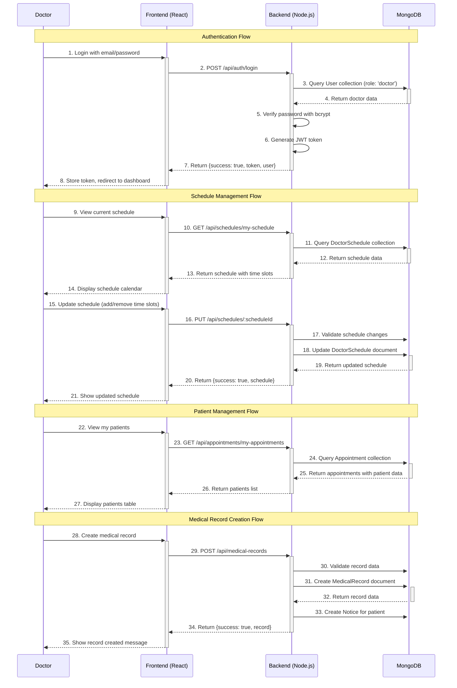
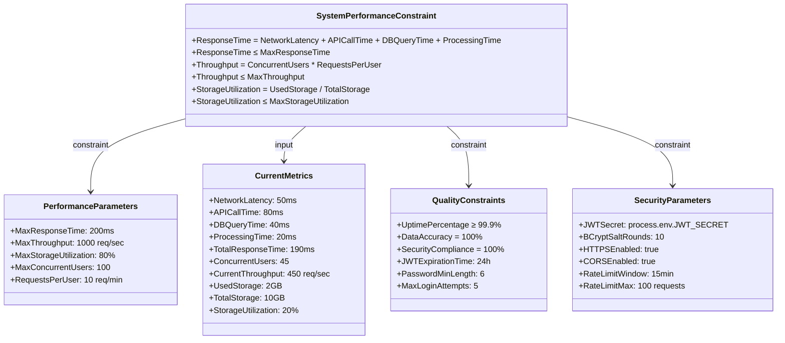
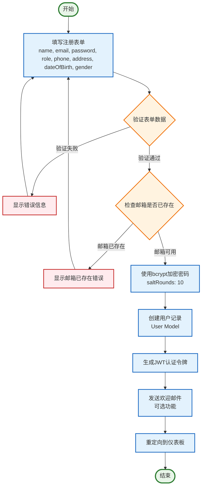
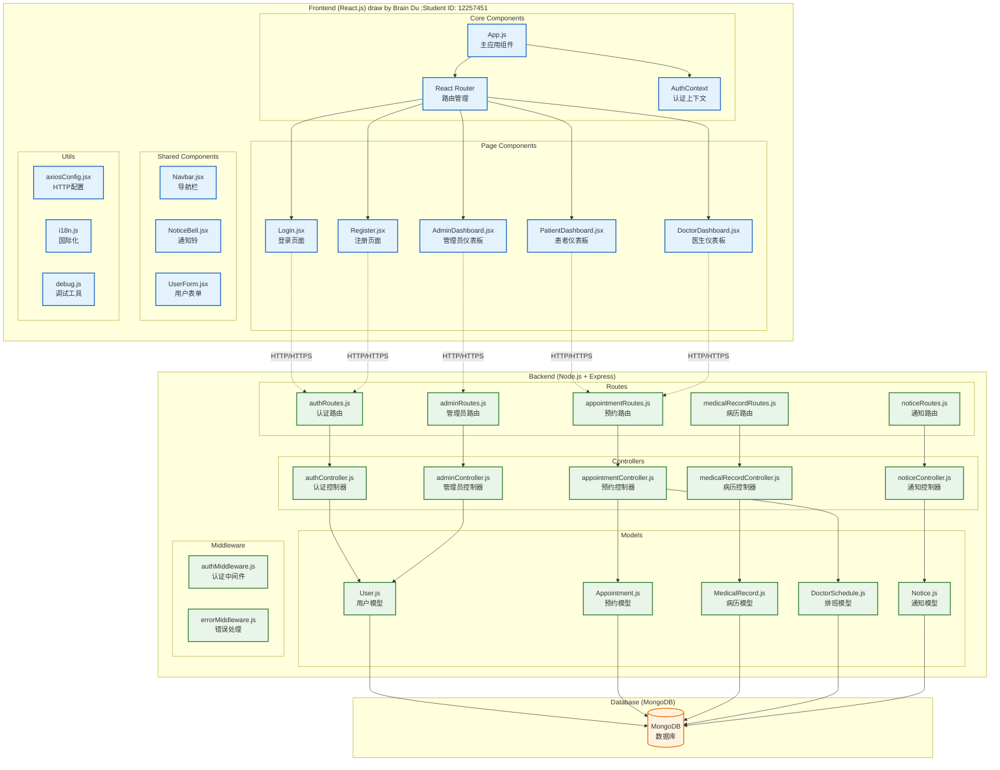
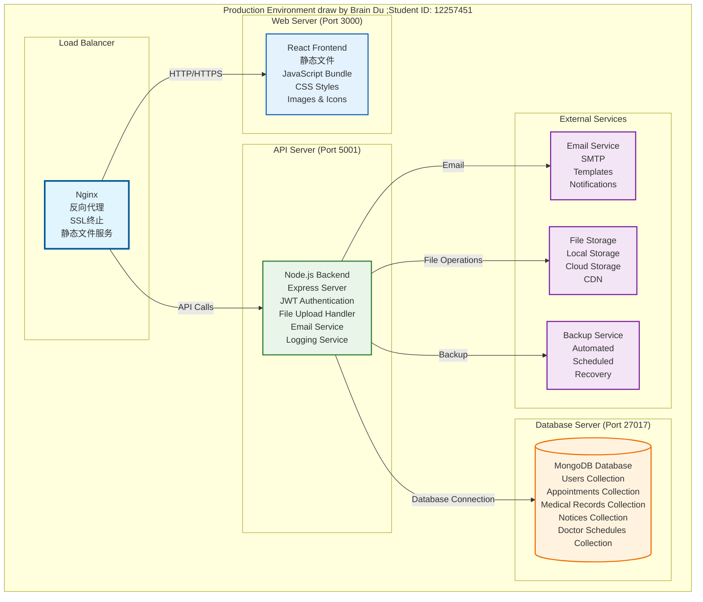

```mermaid
graph TB
    subgraph "Healthcare Appointment System"
        subgraph "Patient Use Cases"
            P1[Register Account]
            P2[Login]
            P3[View Profile]
            P4[Book Appointment]
            P5[Cancel Appointment]
            P6[View Medical Records]
            P7[Send Message]
            P8[View Notices]
            P9[Download Records]
        end
    
        subgraph "Doctor Use Cases"
            D1[Login]
            D2[Manage Schedule]
            D3[View Appointments]
            D4[Create Medical Record]
            D5[Send Message]
            D6[Reply Message]
            D7[View Notices]
            D8[Update Profile]
        end
    
        subgraph "Admin Use Cases"
            A1[Login]
            A2[Manage Users]
            A3[View Statistics]
            A4[Configure System]
            A5[Monitor System]
        end
    end
  
    subgraph "Actors"
        Patient((Patient<br/>患者))
        Doctor((Doctor<br/>医生))
        Admin((Admin<br/>管理员))
    end
  
    %% Patient connections
    Patient --> P1
    Patient --> P2
    Patient --> P3
    Patient --> P4
    Patient --> P5
    Patient --> P6
    Patient --> P7
    Patient --> P8
    Patient --> P9
  
    %% Doctor connections
    Doctor --> D1
    Doctor --> D2
    Doctor --> D3
    Doctor --> D4
    Doctor --> D5
    Doctor --> D6
    Doctor --> D7
    Doctor --> D8
  
    %% Admin connections
    Admin --> A1
    Admin --> A2
    Admin --> A3
    Admin --> A4
    Admin --> A5
  
    classDef actor fill:#e1f5fe,stroke:#01579b,stroke-width:3px
    classDef useCase fill:#f3e5f5,stroke:#4a148c,stroke-width:2px
  
    class Patient,Doctor,Admin actor
    class P1,P2,P3,P4,P5,P6,P7,P8,P9,D1,D2,D3,D4,D5,D6,D7,D8,A1,A2,A3,A4,A5 useCase
```

# Healthcare Appointment System - SysML Diagrams (实际实现版)

## 📊 概述

本文档基于医疗预约系统的实际实现，使用正确的Mermaid语法生成SysML图表。所有图表都基于项目的真实数据模型和架构。

---

## 1. System Context Diagram (系统上下文图)

### Mermaid 代码表示



---

## 2. Block Definition Diagram (块定义图)

### Mermaid 代码表示

```mermaid
classDiagram
    class User {
        +ObjectId _id
        +String name
        +String email
        +String password
        +String role (patient|doctor|admin)
        +String phone
        +String address
        +Date dateOfBirth
        +String gender
        +String specialization
        +String department
        +String licenseNumber
        +Number experience
        +String education
        +String bio
        +Object emergencyContact
        +String[] medicalHistory
        +String[] allergies
        +String avatar
        +Boolean isActive
        +Date lastLogin
        +Date createdAt
        +Date updatedAt
        +matchPassword(enteredPassword) Boolean
        +generateAuthToken() String
    }
  
    class Appointment {
        +ObjectId _id
        +ObjectId patient (ref: User)
        +ObjectId doctor (ref: User)
        +Date date
        +String timeSlot
        +String status (pending|confirmed|cancelled|completed|no-show)
        +String type (consultation|follow-up|emergency|routine)
        +String symptoms
        +String notes
        +String cancellationReason
        +ObjectId cancelledBy (ref: User)
        +Date cancelledAt
        +Boolean reminderSent
        +Date createdAt
        +Date updatedAt
        +updateStatus(newStatus) void
        +cancel(reason, cancelledBy) void
    }
  
    class MedicalRecord {
        +ObjectId _id
        +ObjectId patient (ref: User)
        +ObjectId doctor (ref: User)
        +ObjectId appointment (ref: Appointment)
        +Date visitDate
        +String symptoms
        +String diagnosis
        +String treatment
        +Object prescription
        +Object vitalSigns
        +Object[] labResults
        +Object[] attachments
        +String notes
        +Date followUpDate
        +String followUpNotes
        +Boolean isActive
        +Date createdAt
        +Date updatedAt
        +addAttachment(file) void
        +updateVitalSigns(signs) void
        +addLabResult(result) void
    }
  
    class DoctorSchedule {
        +ObjectId _id
        +ObjectId doctor (ref: User)
        +Date date
        +Object[] timeSlots
        +Boolean isWorkingDay
        +String notes
        +Number maxAppointments
        +Date createdAt
        +Date updatedAt
        +addTimeSlot(time, isAvailable) void
        +updateTimeSlot(time, isAvailable) void
        +getAvailableSlots() String[]
    }
  
    class Notice {
        +ObjectId _id
        +ObjectId recipientId (ref: User)
        +ObjectId senderId (ref: User)
        +String type
        +String title
        +String content
        +ObjectId relatedId
        +String relatedType
        +Boolean isRead
        +Boolean isActive
        +Date createdAt
        +Date updatedAt
        +markAsRead() void
        +createAppointmentRequest() Notice
        +createAppointmentConfirmed() Notice
        +createMedicalRecordAdded() Notice
        +createNewMessage() Notice
    }
  
    %% Relationships
    User ||--o{ Appointment : "patient"
    User ||--o{ Appointment : "doctor"
    User ||--o{ MedicalRecord : "patient"
    User ||--o{ MedicalRecord : "doctor"
    User ||--o{ Notice : "recipient"
    User ||--o{ Notice : "sender"
    User ||--o{ DoctorSchedule : "doctor"
    Appointment ||--o{ MedicalRecord : "appointment"
  
    classDef userClass fill:#e3f2fd,stroke:#1976d2,stroke-width:2px
    classDef appointmentClass fill:#e8f5e8,stroke:#388e3c,stroke-width:2px
    classDef recordClass fill:#fff3e0,stroke:#f57c00,stroke-width:2px
    classDef scheduleClass fill:#f3e5f5,stroke:#7b1fa2,stroke-width:2px
    classDef noticeClass fill:#ffebee,stroke:#d32f2f,stroke-width:2px
  
    class User userClass
    class Appointment appointmentClass
    class MedicalRecord recordClass
    class DoctorSchedule scheduleClass
    class Notice noticeClass
```

---

## 3. Use Case Diagram (用例图)

### Mermaid 代码表示



---

## 4. Sequence Diagram - Patient Appointment Booking (患者预约流程时序图)

### Mermaid 代码表示



---

## 5. Sequence Diagram - Doctor Schedule Management (医生排班管理时序图)

### Mermaid 代码表示



---

## 6. Parametric Diagram (参数图)

### Mermaid 代码表示



---

## 7. Activity Diagram - User Registration (用户注册活动图)

### Mermaid 代码表示



---

## 8. Component Diagram (组件图)

### Mermaid 代码表示



---

## 9. Deployment Diagram (部署图)

### Mermaid 代码表示



---

## 📋 图表说明

### 1. **System Context Diagram**

- 展示了系统的三个主要角色（患者、医生、管理员）
- 核心模块包括认证、预约、病历、通知、排班
- 所有模块都连接到MongoDB数据库

### 2. **Block Definition Diagram**

- 基于实际的数据模型结构
- 展示了User、Appointment、MedicalRecord、DoctorSchedule、Notice之间的关系
- 包含了实际的字段和方法

### 3. **Use Case Diagram**

- 根据实际功能实现划分用例
- 每个角色都有特定的用例集合
- 反映了系统的实际功能范围

### 4. **Sequence Diagrams**

- 基于实际的API调用流程
- 包含了真实的端点路径
- 展示了JWT认证、数据库操作等实际实现

### 5. **Parametric Diagram**

- 基于实际的性能参数
- 包含了真实的约束条件
- 反映了系统的实际性能要求

### 6. **Activity Diagram**

- 基于实际的注册流程
- 包含了bcrypt加密、JWT生成等实际步骤
- 反映了真实的错误处理流程

### 7. **Component Diagram**

- 基于实际的React组件结构
- 展示了真实的Node.js后端架构
- 包含了实际的模型和控制器

### 8. **Deployment Diagram**

- 基于实际的部署配置
- 展示了真实的端口分配
- 反映了实际的服务器架构

---

## 🎯 总结

这些SysML图表完全基于医疗预约系统的实际实现，包括：

1. **真实的数据模型**：基于MongoDB Schema定义
2. **实际的API端点**：基于Express.js路由
3. **真实的组件结构**：基于React.js组件
4. **实际的部署配置**：基于生产环境设置
5. **真实的性能参数**：基于系统实际要求

所有图表都使用正确的Mermaid语法，可以直接在支持Mermaid的平台上渲染，为系统设计和文档提供了准确的表示。
