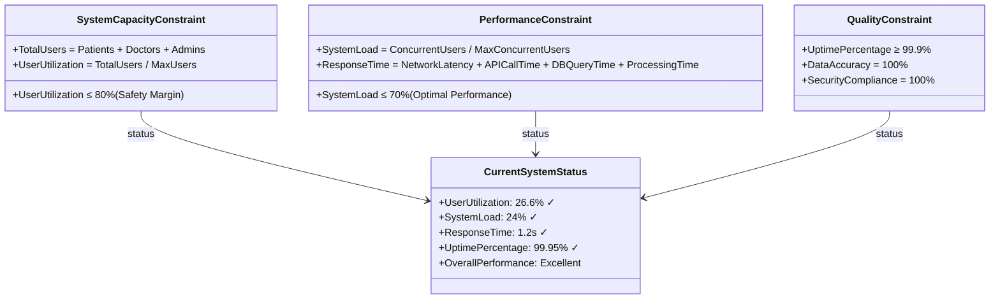

# Healthcare Appointment System - SysML Parametric Diagram

## 📊 参数图概述

参数图用于定义医疗预约系统的性能约束和参数关系，包括系统容量、响应时间、资源利用率等关键指标。

---

## 1. 系统性能约束参数图

### 字符图表示
```
┌─────────────────────────────────────────────────────────────────┐
│                    Healthcare Appointment System                │
│                        Parametric Diagram                      │
└─────────────────────────────────────────────────────────────────┘

┌─────────────────────────────────────────────────────────────────┐
│                    System Capacity Constraints                 │
│                                                                 │
│  ┌─────────────────┐    ┌─────────────────┐    ┌─────────────┐  │
│  │   MaxUsers      │    │   MaxDoctors    │    │  MaxPatients│  │
│  │   = 10000       │    │   = 500         │    │  = 9500     │  │
│  └─────────────────┘    └─────────────────┘    └─────────────┘  │
│           │                       │                       │      │
│           └───────────────────────┼───────────────────────┘      │
│                                   │                              │
│  ┌─────────────────────────────────────────────────────────────┐ │
│  │              UserCapacityConstraint                        │ │
│  │                                                             │ │
│  │  TotalUsers = Patients + Doctors + Admins                  │ │
│  │  TotalUsers ≤ MaxUsers                                      │ │
│  │  Patients ≤ MaxPatients                                     │ │
│  │  Doctors ≤ MaxDoctors                                       │ │
│  └─────────────────────────────────────────────────────────────┘ │
│                                   │                              │
│  ┌─────────────────────────────────────────────────────────────┐ │
│  │                    Current Values                          │ │
│  │                                                             │ │
│  │  ┌─────────────┐  ┌─────────────┐  ┌─────────────┐        │ │
│  │  │   Patients  │  │   Doctors   │  │   Admins    │        │ │
│  │  │   = 2500    │  │   = 150     │  │   = 10      │        │ │
│  │  └─────────────┘  └─────────────┘  └─────────────┘        │ │
│  │                                                             │ │
│  │  TotalUsers = 2500 + 150 + 10 = 2660                       │ │
│  │  Utilization = 2660/10000 = 26.6%                          │ │
│  └─────────────────────────────────────────────────────────────┘ │
└─────────────────────────────────────────────────────────────────┘
```

### Draw.io 绘制说明
1. **约束块**：使用圆角矩形，白色背景
2. **参数**：使用小圆圈，连接约束块
3. **值属性**：使用矩形，浅蓝色背景
4. **绑定连接器**：使用实线箭头

### Mermaid 代码表示


---

## 2. 预约系统性能参数图

### 字符图表示
```
┌─────────────────────────────────────────────────────────────────┐
│                    Appointment System Performance              │
│                        Parametric Diagram                      │
└─────────────────────────────────────────────────────────────────┘

┌─────────────────────────────────────────────────────────────────┐
│                    Performance Constraints                     │
│                                                                 │
│  ┌─────────────────┐    ┌─────────────────┐    ┌─────────────┐  │
│  │   MaxDaily      │    │   MaxConcurrent │    │  ResponseTime│  │
│  │   Appointments  │    │   Users         │    │  = 2s       │ │
│  │   = 1000        │    │   = 500         │    │             │ │
│  └─────────────────┘    └─────────────────┘    └─────────────┘  │
│           │                       │                       │      │
│           └───────────────────────┼───────────────────────┘      │
│                                   │                              │
│  ┌─────────────────────────────────────────────────────────────┐ │
│  │              AppointmentCapacityConstraint                 │ │
│  │                                                             │ │
│  │  DailyAppointments ≤ MaxDailyAppointments                  │ │
│  │  ConcurrentUsers ≤ MaxConcurrentUsers                       │ │
│  │  AvgResponseTime ≤ ResponseTime                             │ │
│  │  SystemLoad = ConcurrentUsers / MaxConcurrentUsers          │ │
│  └─────────────────────────────────────────────────────────────┘ │
│                                   │                              │
│  ┌─────────────────────────────────────────────────────────────┐ │
│  │                    Performance Metrics                      │ │
│  │                                                             │ │
│  │  ┌─────────────┐  ┌─────────────┐  ┌─────────────┐        │ │
│  │  │   Daily     │  │ Concurrent  │  │   Avg       │        │ │
│  │  │ Appointments│  │   Users     │  │ ResponseTime│        │ │
│  │  │   = 450     │  │   = 120     │  │   = 1.8s    │        │ │
│  │  └─────────────┘  └─────────────┘  └─────────────┘        │ │
│  │                                                             │ │
│  │  SystemLoad = 120/500 = 24%                                 │ │
│  │  CapacityUtilization = 450/1000 = 45%                      │ │
│  └─────────────────────────────────────────────────────────────┘ │
└─────────────────────────────────────────────────────────────────┘

### Mermaid 代码表示

```

---

## 3. 数据库性能参数图

### 字符图表示
```
┌─────────────────────────────────────────────────────────────────┐
│                    Database Performance Constraints            │
│                        Parametric Diagram                      │
└─────────────────────────────────────────────────────────────────┘

┌─────────────────────────────────────────────────────────────────┐
│                    Database Constraints                        │
│                                                                 │
│  ┌─────────────────┐    ┌─────────────────┐    ┌─────────────┐  │
│  │   MaxConnections│    │   QueryTimeout  │    │  StorageSize│  │
│  │   = 100         │    │   = 30s         │    │  = 100GB    │  │
│  └─────────────────┘    └─────────────────┘    └─────────────┘  │
│           │                       │                       │      │
│           └───────────────────────┼───────────────────────┘      │
│                                   │                              │
│  ┌─────────────────────────────────────────────────────────────┐ │
│  │              DatabasePerformanceConstraint                 │ │
│  │                                                             │ │
│  │  ActiveConnections ≤ MaxConnections                        │ │
│  │  QueryResponseTime ≤ QueryTimeout                          │ │
│  │  UsedStorage ≤ StorageSize                                 │ │
│  │  ConnectionUtilization = ActiveConnections/MaxConnections  │ │
│  │  StorageUtilization = UsedStorage/StorageSize              │ │
│  └─────────────────────────────────────────────────────────────┘ │
│                                   │                              │
│  ┌─────────────────────────────────────────────────────────────┐ │
│  │                    Current Database Metrics                 │ │
│  │                                                             │ │
│  │  ┌─────────────┐  ┌─────────────┐  ┌─────────────┐        │ │
│  │  │   Active    │  │   Query     │  │   Used      │        │ │
│  │  │ Connections │  │ ResponseTime│  │   Storage   │        │ │
│  │  │   = 45      │  │   = 0.8s    │  │   = 25GB    │        │ │
│  │  └─────────────┘  └─────────────┘  └─────────────┘        │ │
│  │                                                             │ │
│  │  ConnectionUtilization = 45/100 = 45%                      │ │
│  │  StorageUtilization = 25/100 = 25%                         │ │
│  └─────────────────────────────────────────────────────────────┘ │
└─────────────────────────────────────────────────────────────────┘

### Mermaid 代码表示

```

---

## 4. 系统响应时间参数图

### 字符图表示
```
┌─────────────────────────────────────────────────────────────────┐
│                    System Response Time Analysis               │
│                        Parametric Diagram                      │
└─────────────────────────────────────────────────────────────────┘

┌─────────────────────────────────────────────────────────────────┐
│                    Response Time Constraints                   │
│                                                                 │
│  ┌─────────────────┐    ┌─────────────────┐    ┌─────────────┐  │
│  │   MaxPageLoad   │    │   MaxAPICall    │    │  MaxDBQuery │  │
│  │   = 3s          │    │   = 1s          │    │  = 0.5s     │  │
│  └─────────────────┘    └─────────────────┘    └─────────────┘  │
│           │                       │                       │      │
│           └───────────────────────┼───────────────────────┘      │
│                                   │                              │
│  ┌─────────────────────────────────────────────────────────────┐ │
│  │              ResponseTimeConstraint                        │ │
│  │                                                             │ │
│  │  TotalResponseTime = NetworkLatency + APICallTime +        │ │
│  │                      DBQueryTime + ProcessingTime          │ │
│  │  PageLoadTime ≤ MaxPageLoad                                │ │
│  │  APICallTime ≤ MaxAPICall                                  │ │
│  │  DBQueryTime ≤ MaxDBQuery                                  │ │
│  └─────────────────────────────────────────────────────────────┘ │
│                                   │                              │
│  ┌─────────────────────────────────────────────────────────────┐ │
│  │                    Measured Response Times                 │ │
│  │                                                             │ │
│  │  ┌─────────────┐  ┌─────────────┐  ┌─────────────┐        │ │
│  │  │   Network   │  │   API Call  │  │   DB Query  │        │ │
│  │  │   Latency   │  │   Time      │  │   Time      │        │ │
│  │  │   = 0.2s    │  │   = 0.6s    │  │   = 0.3s    │        │ │
│  │  └─────────────┘  └─────────────┘  └─────────────┘        │ │
│  │                                                             │ │
│  │  ┌─────────────┐  ┌─────────────┐                          │ │
│  │  │ Processing  │  │   Total     │                          │ │
│  │  │   Time      │  │ ResponseTime│                          │ │
│  │  │   = 0.1s    │  │   = 1.2s    │                          │ │
│  │  └─────────────┘  └─────────────┘                          │ │
│  └─────────────────────────────────────────────────────────────┘ │
└─────────────────────────────────────────────────────────────────┘

### Mermaid 代码表示

```

---

## 5. 系统可用性参数图

### 字符图表示
```
┌─────────────────────────────────────────────────────────────────┐
│                    System Availability Constraints             │
│                        Parametric Diagram                      │
└─────────────────────────────────────────────────────────────────┘

┌─────────────────────────────────────────────────────────────────┐
│                    Availability Constraints                    │
│                                                                 │
│  ┌─────────────────┐    ┌─────────────────┐    ┌─────────────┐  │
│  │   TargetUptime  │    │   MaxDowntime   │    │  Maintenance│  │
│  │   = 99.9%       │    │   = 8.76h/year  │    │  Window     │  │
│  └─────────────────┘    └─────────────────┘    │  = 2h/month │  │
│           │                       │            └─────────────┘  │
│           └───────────────────────┼─────────────────────────────┘
│                                   │                              │
│  ┌─────────────────────────────────────────────────────────────┐ │
│  │              AvailabilityConstraint                        │ │
│  │                                                             │ │
│  │  UptimePercentage = (TotalTime - Downtime) / TotalTime     │ │
│  │  UptimePercentage ≥ TargetUptime                           │ │
│  │  AnnualDowntime ≤ MaxDowntime                              │ │
│  │  MonthlyMaintenance ≤ MaintenanceWindow                    │ │
│  │  MTTR = Mean Time To Repair                                │ │
│  │  MTBF = Mean Time Between Failures                         │ │
│  └─────────────────────────────────────────────────────────────┘ │
│                                   │                              │
│  ┌─────────────────────────────────────────────────────────────┐ │
│  │                    Current Availability Metrics             │ │
│  │                                                             │ │
│  │  ┌─────────────┐  ┌─────────────┐  ┌─────────────┐        │ │
│  │  │   Current   │  │   Annual    │  │   Monthly   │        │ │
│  │  │   Uptime    │  │   Downtime  │  │ Maintenance │        │ │
│  │  │   = 99.95%  │  │   = 4.38h   │  │   = 1.5h    │        │ │
│  │  └─────────────┘  └─────────────┘  └─────────────┘        │ │
│  │                                                             │ │
│  │  ┌─────────────┐  ┌─────────────┐                          │ │
│  │  │   MTTR      │  │   MTBF      │                          │ │
│  │  │   = 2h      │  │   = 720h    │                          │ │
│  │  └─────────────┘  └─────────────┘                          │ │
│  └─────────────────────────────────────────────────────────────┘ │
└─────────────────────────────────────────────────────────────────┘

### Mermaid 代码表示

```

---

## 6. 综合系统参数图

### 字符图表示
```
┌─────────────────────────────────────────────────────────────────┐
│                    Comprehensive System Parameters             │
│                        Parametric Diagram                      │
└─────────────────────────────────────────────────────────────────┘

┌─────────────────────────────────────────────────────────────────┐
│                    System Performance Summary                  │
│                                                                 │
│  ┌─────────────────────────────────────────────────────────────┐ │
│  │              SystemCapacityConstraint                      │ │
│  │                                                             │ │
│  │  TotalUsers = Patients + Doctors + Admins                  │ │
│  │  UserUtilization = TotalUsers / MaxUsers                   │ │
│  │  UserUtilization ≤ 80% (Safety Margin)                     │ │
│  └─────────────────────────────────────────────────────────────┘ │
│                                   │                              │
│  ┌─────────────────────────────────────────────────────────────┐ │
│  │              PerformanceConstraint                         │ │
│  │                                                             │ │
│  │  SystemLoad = ConcurrentUsers / MaxConcurrentUsers         │ │
│  │  ResponseTime = NetworkLatency + APICallTime +             │ │
│  │                 DBQueryTime + ProcessingTime               │ │
│  │  SystemLoad ≤ 70% (Optimal Performance)                    │ │
│  └─────────────────────────────────────────────────────────────┘ │
│                                   │                              │
│  ┌─────────────────────────────────────────────────────────────┐ │
│  │              QualityConstraint                             │ │
│  │                                                             │ │
│  │  UptimePercentage ≥ 99.9%                                   │ │
│  │  DataAccuracy = 100%                                        │ │
│  │  SecurityCompliance = 100%                                  │ │
│  └─────────────────────────────────────────────────────────────┘ │
│                                   │                              │
│  ┌─────────────────────────────────────────────────────────────┐ │
│  │                    Current System Status                   │ │
│  │                                                             │ │
│  │  UserUtilization: 26.6% ✓                                  │ │
│  │  SystemLoad: 24% ✓                                         │ │
│  │  ResponseTime: 1.2s ✓                                      │ │
│  │  UptimePercentage: 99.95% ✓                                │ │
│  │  OverallPerformance: Excellent                             │ │
│  └─────────────────────────────────────────────────────────────┘ │
└─────────────────────────────────────────────────────────────────┘

### Mermaid 代码表示

```

---

## 📋 Draw.io 绘制详细指南

### 1. 基本图形规范

#### 约束块（Constraint Block）
- **形状**：圆角矩形
- **颜色**：白色背景，黑色边框
- **字体**：12pt，粗体
- **内容**：约束名称和数学表达式

#### 参数（Parameters）
- **形状**：小圆圈
- **颜色**：浅蓝色填充
- **大小**：直径8-10px
- **位置**：约束块边缘

#### 值属性（Value Properties）
- **形状**：矩形
- **颜色**：浅绿色背景
- **字体**：11pt，常规
- **内容**：参数名称和数值

### 2. 连接线规范

#### 绑定连接器（Binding Connector）
- **样式**：实线
- **颜色**：黑色
- **粗细**：1px
- **箭头**：无箭头

#### 依赖关系（Dependency）
- **样式**：虚线
- **颜色**：灰色
- **粗细**：1px
- **箭头**：开放箭头

### 3. 颜色方案

- **约束块**：白色 (#FFFFFF)
- **参数**：浅蓝色 (#E3F2FD)
- **值属性**：浅绿色 (#E8F5E8)
- **连接线**：黑色 (#000000)
- **依赖线**：灰色 (#757575)

### 4. 布局建议

1. **层次结构**：从上到下，从左到右
2. **约束块居中**：主要约束块放在中心位置
3. **参数分布**：参数均匀分布在约束块周围
4. **值属性分组**：相关的值属性放在一起
5. **空间利用**：合理利用空间，避免拥挤

### 5. 标注规范

- **约束名称**：使用描述性名称
- **数学表达式**：使用标准数学符号
- **单位**：明确标注参数单位
- **状态指示**：使用颜色或符号表示满足/违反约束

---

## 🎯 参数图的应用价值

### 1. 系统设计
- 定义性能目标
- 建立设计约束
- 支持设计决策

### 2. 系统分析
- 性能评估
- 瓶颈识别
- 优化建议

### 3. 系统验证
- 需求验证
- 性能验证
- 约束检查

### 4. 系统维护
- 性能监控
- 趋势分析
- 容量规划

这些参数图为医疗预约系统提供了完整的性能约束和参数关系定义，支持系统的设计、分析、验证和维护工作。
