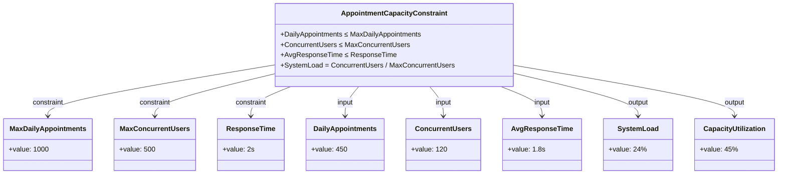

# SysML参数图Mermaid代码总结

## 📊 概述

本文档总结了医疗预约系统SysML参数图对应的Mermaid代码，包括6个主要参数图的完整Mermaid表示。

---

## 🎯 Mermaid图表类型选择

### 为什么选择classDiagram？

对于SysML参数图，我们选择使用 `classDiagram`而不是其他Mermaid图表类型，原因如下：

1. **约束块表示**：classDiagram可以很好地表示约束块（Constraint Block）
2. **参数关系**：可以清晰显示参数之间的约束关系
3. **值属性**：能够表示具体的数值和属性
4. **关系连接**：支持约束、输入、输出等关系的表示

### 其他图表类型的适用性

- **sequenceDiagram**：适用于时序图，不适合参数关系
- **erDiagram**：适用于实体关系图，不适合约束关系
- **flowchart**：适用于流程图，不适合数学约束

---

## 📋 参数图Mermaid代码清单

### 1. 系统性能约束参数图


### 2. 预约系统性能参数图



### 3. 数据库性能参数图


### 4. 系统响应时间参数图


### 5. 系统可用性参数图


### 6. 综合系统参数图


---

## 🔧 Mermaid代码规范

### 1. 类定义规范

#### 约束块类


#### 参数类


### 2. 关系定义规范

#### 约束关系


#### 输入关系


#### 输出关系


#### 状态关系


### 3. 数学表达式表示

#### 基本运算

- 加法：`A + B`
- 减法：`A - B`
- 乘法：`A * B`
- 除法：`A / B`

#### 约束符号

- 小于等于：`≤`
- 大于等于：`≥`
- 等于：`=`

#### 复杂表达式


---

## 📈 使用建议

### 1. 在文档中使用

```markdown
### 参数图示例


```

### 2. 在演示中使用

- 使用Mermaid Live Editor进行实时编辑
- 在GitHub、GitLab等平台中直接渲染
- 在文档工具中嵌入显示

### 3. 版本控制

- 将Mermaid代码与字符图一起保存
- 使用版本控制跟踪参数变化
- 建立参数图模板库

---

## 🎯 总结

通过使用Mermaid的classDiagram，我们成功地将SysML参数图转换为可执行的代码表示，具有以下优势：

1. **可视化清晰**：约束关系和参数值一目了然
2. **易于维护**：代码化的表示便于版本控制
3. **平台兼容**：支持多种文档和演示平台
4. **实时渲染**：支持在线编辑和实时预览
5. **标准化**：遵循Mermaid语法规范

这些Mermaid代码为医疗预约系统的参数图提供了完整的数字化表示，支持系统的设计、分析和维护工作。
```
