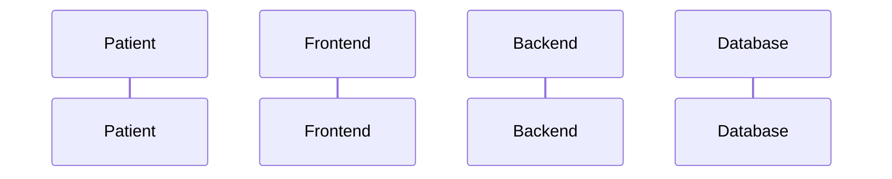
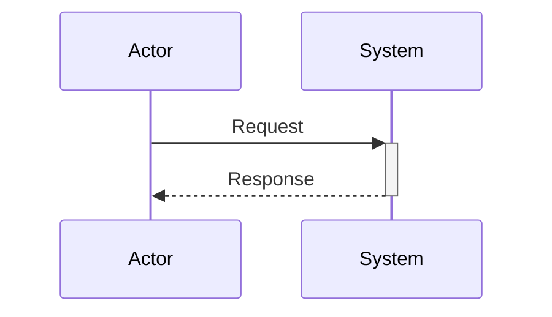
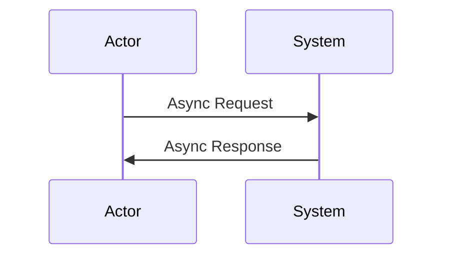
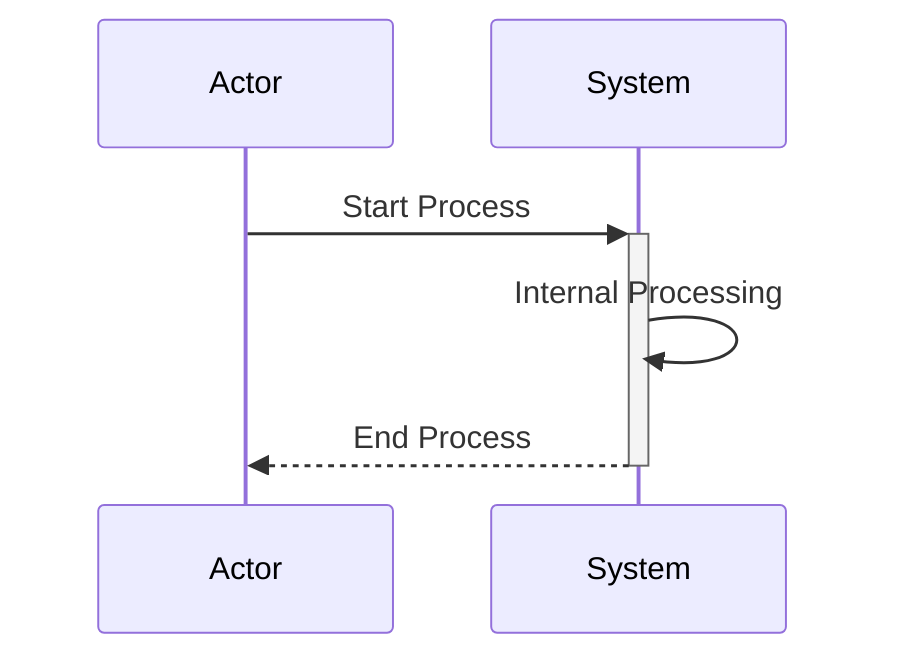
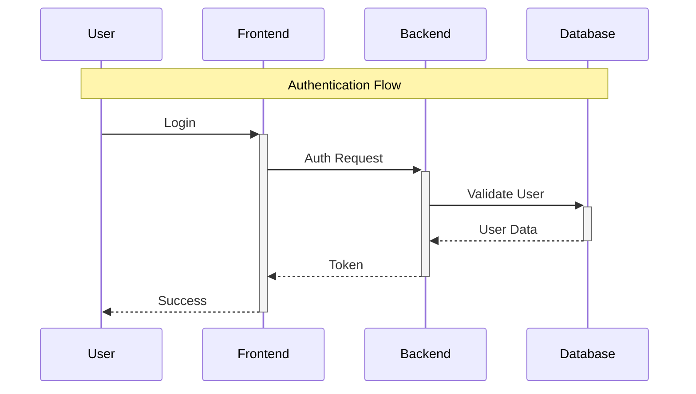
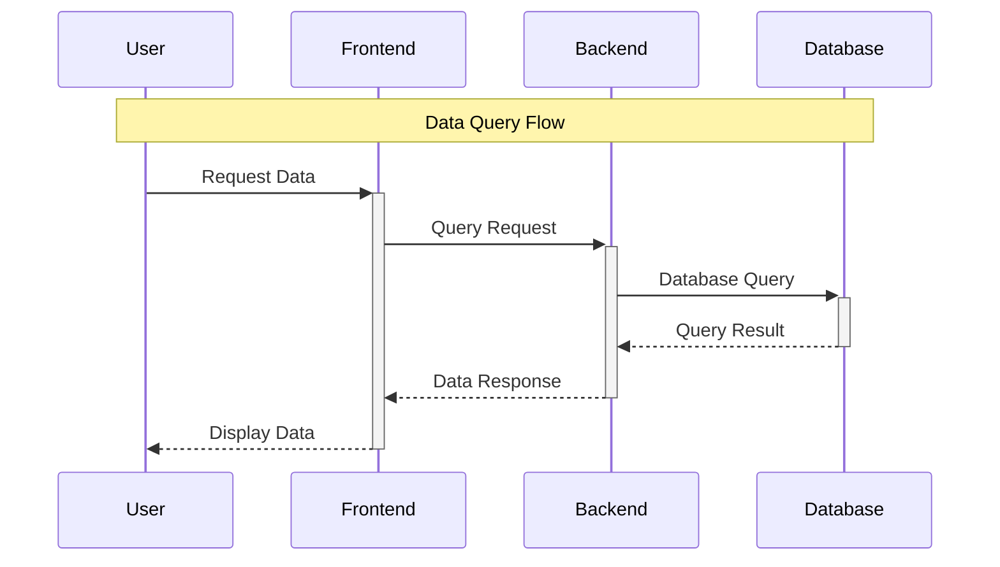

# SysML时序图Mermaid代码总结

## 📊 概述

本文档总结了医疗预约系统SysML时序图对应的Mermaid代码，包括4个主要时序图的完整Mermaid表示。

---

## 🎯 Mermaid图表类型选择

### 为什么选择sequenceDiagram？

对于SysML时序图，我们选择使用`sequenceDiagram`，原因如下：

1. **时序关系表示**：sequenceDiagram专门用于表示参与者之间的时序交互
2. **生命线表示**：可以清晰显示参与者的生命线和激活状态
3. **消息类型**：支持同步消息、异步消息、返回消息等不同类型
4. **参与者定义**：可以定义多个参与者并显示它们之间的交互

### 语法特点

- **参与者定义**：`participant Name as DisplayName`
- **同步消息**：`A->>+B: Message`
- **返回消息**：`B-->>-A: Response`
- **激活框**：使用`+`和`-`表示激活开始和结束

---

## 📋 时序图Mermaid代码清单

### 1. 患者预约流程时序图

```mermaid
sequenceDiagram
    participant P as Patient
    participant F as Frontend
    participant B as Backend
    participant D as Database
    
    P->>+F: 1. Login
    F->>+B: 2. Auth Request
    B->>+D: 3. Validate User
    D-->>-B: 4. Query User
    B-->>-F: 5. Return Token
    F-->>-P: 6. Auth Success
    
    P->>+F: 7. View Doctors
    F->>+B: 8. Get Doctors
    B->>+D: 9. Query Doctors
    D-->>-B: 10. Return Doctors
    B-->>-F: 11. Return Doctors
    F-->>-P: 12. Show Doctors
    
    P->>+F: 13. Select Doctor
    F->>+B: 14. Get Schedule
    B->>+D: 15. Query Schedule
    D-->>-B: 16. Return Schedule
    B-->>-F: 17. Return Schedule
    F-->>-P: 18. Show Schedule
    
    P->>+F: 19. Book Appointment
    F->>+B: 20. Create Appointment
    B->>+D: 21. Validate & Create
    D-->>-B: 22. Save Appointment
    B->>+D: 23. Create Notice
    D-->>-B: 24. Save Notice
    B-->>-F: 25. Return Success
    F-->>-P: 26. Show Success
    P-->>-F: 27. Confirmation
```

### 2. 医生排班管理时序图

```mermaid
sequenceDiagram
    participant Dr as Doctor
    participant F as Frontend
    participant B as Backend
    participant D as Database
    
    Dr->>+F: 1. Login
    F->>+B: 2. Auth Request
    B->>+D: 3. Validate Doctor
    D-->>-B: 4. Query Doctor
    B-->>-F: 5. Return Token
    F-->>-Dr: 6. Auth Success
    
    Dr->>+F: 7. View Schedule
    F->>+B: 8. Get Schedule
    B->>+D: 9. Query Schedule
    D-->>-B: 10. Return Schedule
    B-->>-F: 11. Return Schedule
    F-->>-Dr: 12. Show Schedule
    
    Dr->>+F: 13. Update Schedule
    F->>+B: 14. Update Schedule
    B->>+D: 15. Validate & Update
    D-->>-B: 16. Update Schedule
    B-->>-F: 17. Return Success
    F-->>-Dr: 18. Show Success
    
    Dr->>+F: 19. View Patients
    F->>+B: 20. Get Patients
    B->>+D: 21. Query Patients
    D-->>-B: 22. Return Patients
    B-->>-F: 23. Return Patients
    F-->>-Dr: 24. Show Patients
    
    Dr->>+F: 25. Create Medical Record
    F->>+B: 26. Create Record
    B->>+D: 27. Validate & Create
    D-->>-B: 28. Save Record
    B->>+D: 29. Create Notice
    D-->>-B: 30. Save Notice
    B-->>-F: 31. Return Success
    F-->>-Dr: 32. Show Success
    Dr-->>-F: 33. Record Created
```

### 3. 管理员用户管理时序图

```mermaid
sequenceDiagram
    participant A as Admin
    participant F as Frontend
    participant B as Backend
    participant D as Database
    
    A->>+F: 1. Login
    F->>+B: 2. Auth Request
    B->>+D: 3. Validate Admin
    D-->>-B: 4. Query Admin
    B-->>-F: 5. Return Token
    F-->>-A: 6. Auth Success
    
    A->>+F: 7. View Users
    F->>+B: 8. Get Users
    B->>+D: 9. Query Users
    D-->>-B: 10. Return Users
    B-->>-F: 11. Return Users
    F-->>-A: 12. Show Users
    
    A->>+F: 13. Filter Users
    F->>+B: 14. Filter Users
    B->>+D: 15. Query Filtered
    D-->>-B: 16. Return Filtered Users
    B-->>-F: 17. Return Filtered
    F-->>-A: 18. Show Filtered
    
    A->>+F: 19. Edit User
    F->>+B: 20. Update User
    B->>+D: 21. Validate & Update
    D-->>-B: 22. Update User
    B-->>-F: 23. Return Success
    F-->>-A: 24. Show Success
    
    A->>+F: 25. Disable User
    F->>+B: 26. Disable User
    B->>+D: 27. Update User Status
    D-->>-B: 28. Update User
    B->>+D: 29. Create Notice
    D-->>-B: 30. Save Notice
    B-->>-F: 31. Return Success
    F-->>-A: 32. Show Success
    A-->>-F: 33. User Disabled
```

### 4. 管理员系统统计时序图

```mermaid
sequenceDiagram
    participant A as Admin
    participant F as Frontend
    participant B as Backend
    participant D as Database
    
    A->>+F: 1. View Dashboard
    F->>+B: 2. Get Statistics
    B->>+D: 3. Query User Stats
    D-->>-B: 4. Count Users
    B->>+D: 5. Query Appointment Stats
    D-->>-B: 6. Count Appointments
    B->>+D: 7. Query Medical Record Stats
    D-->>-B: 8. Count Records
    B->>+D: 9. Query Revenue Stats
    D-->>-B: 10. Calculate Revenue
    B->>+D: 11. Aggregate Statistics
    D-->>-B: 12. Return Aggregated Data
    B-->>-F: 13. Return Statistics
    F-->>-A: 14. Show Dashboard
    
    A->>+F: 15. View Charts
    F->>+B: 16. Get Chart Data
    B->>+D: 17. Query Time Series Data
    D-->>-B: 18. Return Time Series Data
    B-->>-F: 19. Return Chart Data
    F-->>-A: 20. Render Charts
    
    A->>+F: 21. Export Report
    F->>+B: 22. Generate Report
    B->>+D: 23. Query Report Data
    D-->>-B: 24. Return Report Data
    B->>+D: 25. Generate PDF/Excel
    D-->>-B: 26. Create File
    B-->>-F: 27. Return File URL
    F-->>-A: 28. Download Report
    A-->>-F: 29. Report Downloaded
```

---

## 🔧 Mermaid代码规范

### 1. 参与者定义规范

#### 基本参与者


#### 角色标识
- **P**：Patient（患者）
- **F**：Frontend（前端）
- **B**：Backend（后端）
- **D**：Database（数据库）
- **Dr**：Doctor（医生）
- **A**：Admin（管理员）

### 2. 消息类型规范

#### 同步消息


#### 异步消息


#### 激活框


### 3. 流程分组规范

#### 认证流程


#### 数据查询流程


---

## 📈 使用建议

### 1. 在文档中使用

```markdown
### 时序图示例

```

### 2. 在演示中使用

- 使用Mermaid Live Editor进行实时编辑
- 在GitHub、GitLab等平台中直接渲染
- 在文档工具中嵌入显示

### 3. 版本控制

- 将Mermaid代码与字符图一起保存
- 使用版本控制跟踪流程变化
- 建立时序图模板库

---

## 🎯 总结

通过使用Mermaid的sequenceDiagram，我们成功地将SysML时序图转换为可执行的代码表示，具有以下优势：

1. **时序清晰**：参与者之间的交互时序一目了然
2. **易于维护**：代码化的表示便于版本控制
3. **平台兼容**：支持多种文档和演示平台
4. **实时渲染**：支持在线编辑和实时预览
5. **标准化**：遵循Mermaid语法规范

这些Mermaid代码为医疗预约系统的时序图提供了完整的数字化表示，支持系统的设计、分析和维护工作。

---

## 📚 相关文档

- [SysML参数图Mermaid代码总结](./SYSML_PARAMETRIC_DIAGRAM_MERMAID_SUMMARY.md)
- [SysML图表完整文档](./SYSML_DIAGRAMS.md)
- [SysML参数图文档](./SYSML_PARAMETRIC_DIAGRAM.md)
